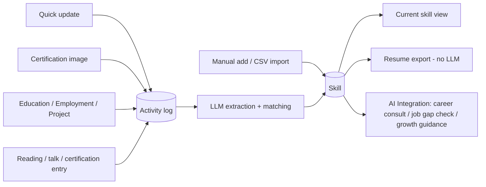
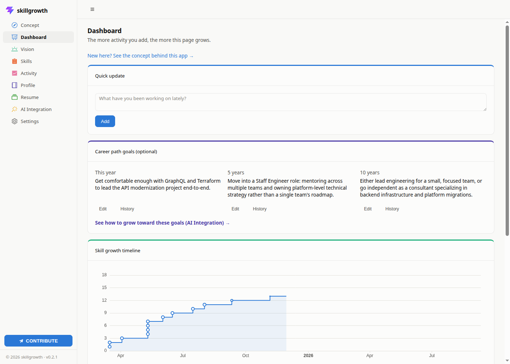
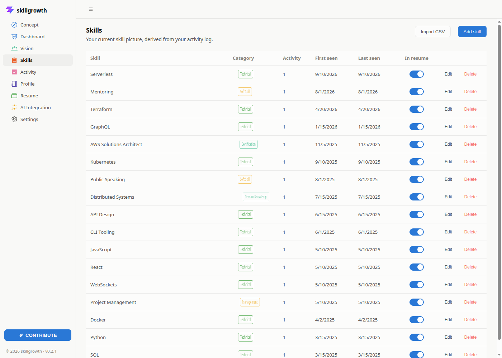
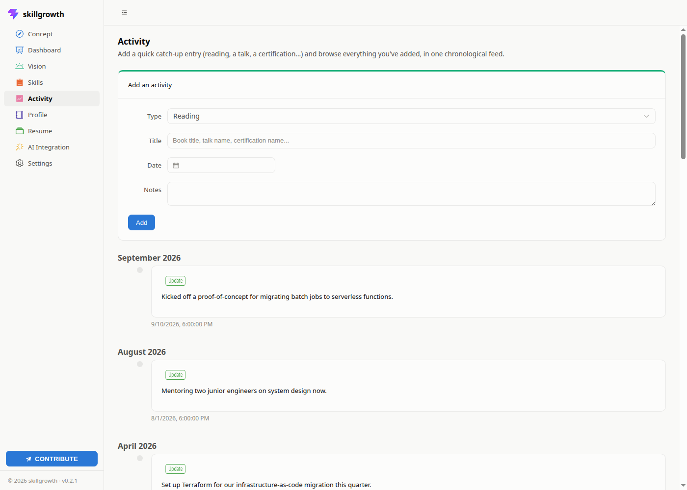
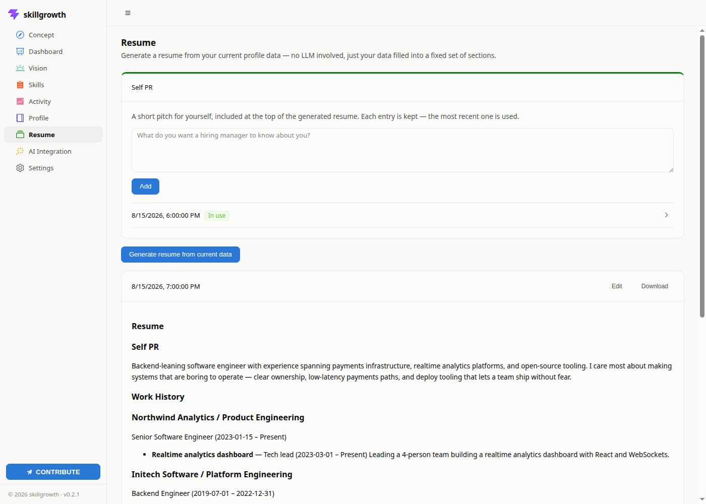

# skillgrowth

A self-hosted tool for your career and skill growth that grows together
with you, instead of asking you to fill out a static profile once.

**Who it's for:** working professionals building their career over the
long term — but it's especially useful if you're actively job hunting or
considering a change, since your skills, activity, and history are
already organized into a ready-to-use resume the moment you need one,
instead of having to reconstruct them from memory under time pressure.

> **A note on terminology:** every "skill" in this app is one of *your own*
> career/professional skills (e.g. "Python", "public speaking", "project
> management") — not an AI "skill" in the sense of a Claude Code Skill, an
> LLM plugin, or an agent capability. skillgrowth tracks skills that belong
> to you as a person; the LLM it optionally talks to is just a tool it
> uses to extract and match them, not a source of skills itself.

## Why

Your career history keeps ending up on someone else's platform. During a
job search, it's a recruiter's site. During a performance review, it's
your employer's internal HR system. Either way, that data was never
really yours — and when you leave, it stays behind. What you're actually
left holding, if anything, is a handful of scattered Word and Excel files
you happened to save yourself.

skillgrowth exists to fix that: your career record — skills, evidence,
history, resume — lives on your own server, under your own control, built
up on your own initiative rather than only when a job search or an annual
review forces you to think about it. The goal is a skill set that's
genuinely yours, portable across employers, not something a company's
database happens to be holding onto this year.

Every piece of activity you feed it — a quick update, a certification
photo, an education/employment/project record, a reading/talk/certification
entry — is kept as an append-only activity log. An LLM extracts skills
from that activity and matches them against skills you already have, so
your skill picture and a ready-to-use resume can be derived from the log
at any time — the resume itself is generated from a fixed template, no
LLM required. Skills can also be added directly (one at a time, or in bulk
via CSV) when you don't have free-text activity to extract from.



See [docs/ARCHITECTURE.md](docs/ARCHITECTURE.md) for the full data model and
request flow.

## Features

Full feature list: [docs/FEATURES.md](docs/FEATURES.md) ([日本語](docs/FEATURES.ja.md)).

- **Dashboard** — career path goals (this year / 5 years / 10 years,
  optional, editable with a full — paginated — history of past edits), a
  skill growth timeline chart, a category breakdown chart, a quick
  update box, and a Reflect card showing what's changed since you last
  marked yourself as having reflected — each reflection can carry an
  optional comment, browsable later via a paginated History link.
- **Vision** — one free-form text box for a rough sketch of the kind of
  career you're aiming for, with no time horizon or structure — a looser
  complement to the Dashboard's three specific goals.
- **Profile** — education, employment, and projects (standalone or linked to
  an employer). Free-text descriptions also feed skill extraction.
- **Portfolio** — deliverables and work samples: title, description (not
  fed into skill extraction), any number of links, and any number of
  uploaded files (PDF, spreadsheets, photos, up to 10MB each). Can
  optionally link to a standalone project, never one tied to an employer.
- **Skills** — the current skill picture derived from the activity log;
  supports adding a skill directly by name, editing a skill's name/category
  in place, or importing a batch from a `name,category` CSV file —
  deliberately not resume parsing, since a personal resume's layout is too
  format-dependent for reliable extraction.
- **Activity** — add a reading/talk/certification entry (with optional
  certificate image upload for OCR extraction) and browse a chronological
  feed of everything that's been added, in one page.
- **Resume** — a Self PR field (kept as paginated history, most recent
  used) plus a resume generator that fills a fixed Markdown template from
  your current data — **no LLM involved**, rendered and downloadable, with
  past generations kept as browsable snapshots, any of which can be edited
  directly as Markdown afterward. Alongside that, upload your own `.docx`
  template with tags like `{{p self_pr }}` and generate a filled copy of
  it — also no LLM involved, with per-section bullet-list/table layout
  chosen from the UI.
- **AI Integration** — the only features that call an LLM on demand:
  Career Consult (a saved, multi-turn chat with an AI career consultant,
  grounded in your actual skills/activity/history/goals on every
  message), growth guidance toward each Dashboard goal, and a
  job-posting gap check (paste a job description to see which of its
  requirements you already meet).
- **Settings** — language, theme (light/dark/system) and an accent color,
  the LLM connection (base URL / API key / model, with a test button), a
  skill extraction toggle (**off by default** — turn it on to have Quick
  update/Activity/Profile text automatically run through the LLM; off,
  those saves are instant with no LLM call), a full data backup download,
  restoring from a backup file, and an About panel with the app version
  and license.
- A **Contribute** button lives in the sidebar on every page (above the
  copyright line) — skillgrowth is MIT-licensed and issues/PRs are
  genuinely welcome.

## Screenshots

Shown with the built-in sample data (Settings → "Try it with sample
data"), not a real account.

| Dashboard | Skills |
|---|---|
|  |  |

| Activity | Resume |
|---|---|
|  |  |

## Design choices

- **Single user, self-hosted.** No auth, no multi-tenancy. Run your own
  instance the way you'd self-host a personal finance tool.
- **Free-text skills.** No fixed taxonomy. Skills are stored as the natural
  language the LLM extracts from your activity (or that you type directly),
  not normalized IDs.
- **LLM-optional, not LLM-required.** Extracting skills from free text and
  the AI Integration features are the only things that call an LLM.
  Adding/editing skills by hand, career path goals, Vision, Self PR,
  resume generation, and backup/restore all work with none configured.
  Extraction itself is also **off by default** even once an LLM is
  configured — a separate Settings toggle you turn on explicitly, so a
  slow local model never blocks a save unless you've asked for it to.
- **Pluggable LLM.** When a feature does call one, it talks to any
  OpenAI-compatible chat completions endpoint — a cloud API or a local
  Ollama server (`http://localhost:11434/v1`). Configured from the
  Settings page.
- **Activity, not self-assessment.** Skills mostly come from things you
  already have (certificates, project notes, a CSV export from wherever you
  already track this) rather than from filling out a skill matrix — though
  you can also add a skill by hand.

## Quick start

```bash
docker compose up --build
```

Open http://localhost:8000, then set your LLM connection under Settings.
Want to see what a populated app looks like first? Settings → "Try it with
sample data" loads a small fictional career history with one click.

### Example LLM configurations

Any OpenAI-compatible Chat Completions endpoint works. A few confirmed to
work as of this writing:

| Provider | Base URL | API key | Notes |
|---|---|---|---|
| OpenAI | `https://api.openai.com/v1` | an OpenAI API key | the default |
| Ollama (local) | `http://localhost:11434/v1` | anything non-empty | run a model locally, no external calls |
| Claude (Anthropic) | `https://api.anthropic.com/v1/` | an Anthropic API key | Anthropic's docs describe this OpenAI-compatible layer as being for quick evaluation, not a long-term production integration — some features (e.g. prompt caching) aren't available through it |
| Gemini (Google) | `https://generativelanguage.googleapis.com/v1beta/openai/` | a Gemini API key from Google AI Studio | documented as beta by Google |

None of these let you authenticate with a consumer subscription login
(e.g. a Claude Pro/Max or ChatGPT Plus account) instead of a billed API
key — neither Anthropic nor OpenAI allow that for third-party
applications, so a metered API key is the only option regardless of
provider.

## Usage

A typical first session looks like this:

1. **Settings → LLM connection.** Point it at OpenAI, another
   OpenAI-compatible provider, or a local Ollama server, then "Test
   connection." Skip this if you only want the LLM-free parts of the app
   (Resume, backup/restore, browsing) for now — you can come back to it
   later. Skill extraction itself is a separate toggle on the same page,
   **off by default** — turn it on if you want step 3 below to actually
   extract skills from what you write.
2. **Settings → Try it with sample data**, if you want to see a populated
   app before typing anything yourself. A matching "Reset sample data"
   button removes exactly what this added, whenever you're ready to start
   for real.
3. **Dashboard → Quick update.** Write a sentence or two about something
   you've been working on. With skill extraction turned on (step 1),
   this is the fastest way to see the evidence → extraction → skill loop
   in action: submit it, and any skills the LLM recognized show up
   immediately. With it off, the same submit just saves your update to
   the activity log instantly, with no skills extracted.
4. **Activity**, **Profile**, and **Skills** are the other ways to feed the
   same loop: log a certification or a book you read on Activity, fill in
   education/employment/projects on Profile (their free-text fields feed
   extraction too), or add a skill directly on Skills if you already know
   you have it and don't need evidence for it.
5. **Dashboard → Career path goals** and **Vision**, whenever you want to
   write down where you're headed — goals are time-boxed (this year / 5
   years / 10 years) and keep a full edit history; Vision is one looser,
   unstructured paragraph with no history, for whatever doesn't fit into
   "by when."
6. **Resume**, once you have some Profile/Activity data: write a Self PR
   pitch, then "Generate resume from current data." No LLM call — it's
   your data poured into a fixed template — so this works even before
   step 1. Every generation is kept, so you can always go back to an
   earlier version.
7. **AI Integration**, only if you configured an LLM in step 1: start a
   Career Consult conversation, paste a job posting for a gap check
   against your current skills, or ask for growth guidance toward the
   goals you wrote in step 5.
8. **Settings → Data backup**, occasionally: downloads everything (except
   the LLM connection settings) as one JSON file. Restoring it later — on
   this instance or a fresh one — is purely additive, so it's safe to
   import into an install that already has data.

## Local development

See [docs/CONTRIBUTING.md](docs/CONTRIBUTING.md) for running the backend and
frontend separately with hot reload.

## Known limitations

- Certification ingestion accepts images only (no PDF parsing yet).
- No resume/CV parsing by design — see "Design choices" above.
- The "current skills" view is read from the database directly, but the
  match/merge step that keeps it deduplicated runs at evidence-ingestion
  time via an LLM call — quality depends on the configured model.
- The Markdown resume generator follows a fixed set of sections and isn't
  customizable per-export; edit the downloaded Markdown by hand for
  anything beyond that, or use the Word template export for a custom
  layout instead.

## Changelog

See [CHANGELOG.md](CHANGELOG.md).

## License

MIT — see [LICENSE](LICENSE).
