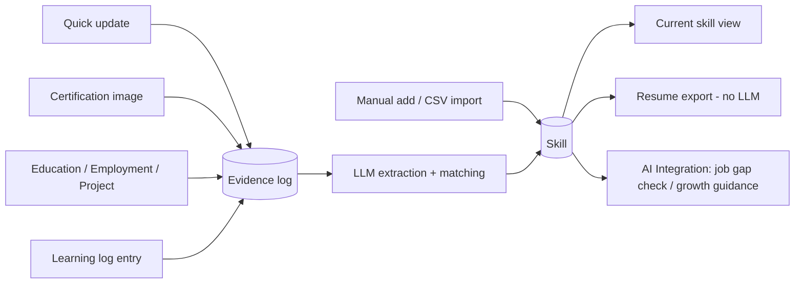

# skillgrowth

Self-hosted career tracker that grows alongside your career, instead of
asking you to fill out a static profile once.

Every piece of evidence you feed it — a quick update, a certification
photo, an education/employment/project record, a learning log entry — is
kept as an append-only evidence log. An LLM extracts skills from that
evidence and matches them against skills you already have, so your skill
picture and a ready-to-use resume can be derived from the log at any time —
the resume itself is generated from a fixed template, no LLM required.
Skills can also be added directly (one at a time, or in bulk via CSV) when
you don't have free-text evidence to extract from.



See [docs/ARCHITECTURE.md](docs/ARCHITECTURE.md) for the full data model and
request flow.

## Features

Full feature list: [docs/FEATURES.md](docs/FEATURES.md) ([日本語](docs/FEATURES.ja.md)).

- **Dashboard** — career path goals (this year / 5 years / 10 years,
  optional), a skill growth timeline chart, a category breakdown chart, and a
  quick update box.
- **Profile** — education, employment, and projects (standalone or linked to
  an employer). Free-text descriptions also feed skill extraction.
- **Learning log** — reading, talks given/attended, certifications (with
  optional certificate image upload for OCR extraction).
- **Skills** — the current skill picture derived from the evidence log; also
  supports adding a skill directly by name, or importing a batch from a
  `name,category` CSV file — deliberately not resume parsing, since a
  personal resume's layout is too format-dependent for reliable extraction.
- **Evidence log** — a chronological feed of everything that has been added.
- **Resume** — a Self PR field (kept as history, most recent used) plus a
  resume generator that fills a fixed Markdown template from your current
  data — **no LLM involved**, rendered and downloadable, with past
  generations kept as browsable snapshots.
- **AI Integration** — the only two features that call an LLM on demand:
  growth guidance toward each Dashboard goal, and a job-posting gap check
  (paste a job description to see which of its requirements you already
  meet).
- **Settings** — LLM connection (base URL / API key / model, with a test
  button), a full data backup download, and restoring from a backup file.
- English by default, switchable to Japanese from the top bar.

## Design choices

- **Single user, self-hosted.** No auth, no multi-tenancy. Run your own
  instance the way you'd self-host a personal finance tool.
- **Free-text skills.** No fixed taxonomy. Skills are stored as the natural
  language the LLM extracts from your evidence (or that you type directly),
  not normalized IDs.
- **Pluggable LLM.** Talks to any OpenAI-compatible chat completions
  endpoint — a cloud API or a local Ollama server
  (`http://localhost:11434/v1`). Configured from the Settings page.
- **Evidence, not self-assessment.** Skills mostly come from things you
  already have (certificates, project notes, a CSV export from wherever you
  already track this) rather than from filling out a skill matrix — though
  you can also add a skill by hand.

## Quick start

```bash
docker compose up --build
```

Open http://localhost:8000, then set your LLM connection under Settings.
Want to see what a populated app looks like first? Settings → "Try it with
sample data" loads a small fictional career history with one click.

## Local development

See [docs/CONTRIBUTING.md](docs/CONTRIBUTING.md) for running the backend and
frontend separately with hot reload.

## Known limitations

- Certification ingestion accepts images only (no PDF parsing yet).
- No resume/CV parsing by design — see "Design choices" above.
- The "current skills" view is read from the database directly, but the
  match/merge step that keeps it deduplicated runs at evidence-ingestion
  time via an LLM call — quality depends on the configured model.
- Generated resumes follow a fixed set of sections and aren't customizable
  per-export; edit the downloaded Markdown by hand for anything beyond that.

## License

MIT — see [LICENSE](LICENSE).
