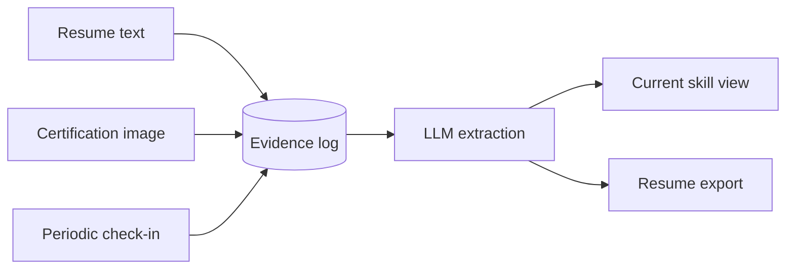

# skillgrowth

Self-hosted career/skill tracker that grows alongside your career, instead of
asking you to fill out a static profile once.

Every piece of evidence you feed it — a pasted resume, a certification photo,
a short periodic check-in note — is kept as an append-only log. The app
re-derives your current skill picture, and a ready-to-use resume, from that
log at any time.



## Design choices

- **Single user, self-hosted.** No auth, no multi-tenancy. Run your own
  instance the way you'd self-host a personal finance tool.
- **Free-text skills.** No fixed taxonomy. Skills are stored as the natural
  language the LLM extracts from your evidence, not normalized IDs.
- **Pluggable LLM.** Talks to any OpenAI-compatible chat completions
  endpoint — OpenAI, a hosted API, or a local Ollama server
  (`http://localhost:11434/v1`). Configure via `.env`, not code.
- **Evidence, not self-assessment.** Skills come from things you already
  have (resume, certificates, notes), not from filling out a skill matrix.

## Quick start

```bash
cp .env.example .env
# edit .env with your OPENAI_BASE_URL / OPENAI_API_KEY / LLM_MODEL
docker compose up --build
```

Open http://localhost:8000.

## Current MVP scope / known limitations

- Certification ingestion accepts images only (no PDF parsing yet).
- Resume ingestion is paste-as-text (no PDF/Word upload yet).
- The "current skills" view and resume export are regenerated from the full
  evidence log on each request — fine for personal-scale data, not optimized.

## License

MIT — see [LICENSE](LICENSE).
