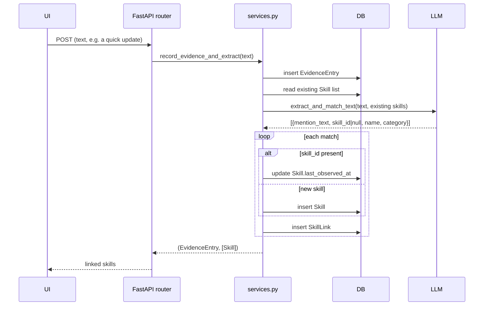

# Architecture

## Stack

- **Backend**: FastAPI + SQLModel (SQLite), Python 3.12. Talks to an
  OpenAI-compatible chat completions endpoint via the `openai` SDK.
- **Frontend**: Vue 3 + Vite + Element Plus + vue-router + vue-i18n +
  ECharts (via vue-echarts). Built to static assets and served by FastAPI in
  production (see `app/main.py`'s SPA fallback route and the multi-stage
  `Dockerfile`).
- **Data**: a single SQLite file at `data/skillgrowth.db`. No message queue,
  no background workers — every LLM call happens synchronously inside the
  request that triggered it.

## Data model

The activity log (the `EvidenceEntry` table — the name predates the
user-facing "Activity" wording, but renaming it would touch every router,
service, and migration for no behavioral gain, so the class name stays)
is the source of truth. `Skill` is a materialized entity derived from it,
not recomputed on every read — this is what makes the skill growth
timeline and category charts possible without repeated LLM calls on every
page view.

```mermaid
erDiagram
  EvidenceEntry ||--o{ SkillLink : "extraction links to"
  Skill ||--o{ SkillLink : "referenced by"
  EvidenceEntry ||--o| Education : "backs"
  EvidenceEntry ||--o| Employment : "backs"
  EvidenceEntry ||--o| Project : "backs"
  EvidenceEntry ||--o| LearningActivity : "backs"
  Employment ||--o{ Project : "may contain"
  CareerGoal ||--o{ CareerGoalHistory : "past versions (matched by horizon, not a real FK)"
  ConsultSession ||--o{ ConsultMessage : "has"

  EvidenceEntry {
    string id
    string source_type "certification/checkin/education/employment/project/learning_activity"
    text raw_input
    string file_path "nullable, image evidence only"
    datetime created_at
  }
  Skill {
    string id
    string name "free text, not a fixed taxonomy"
    string category "LLM-assigned, loose"
    datetime first_observed_at
    datetime last_observed_at
  }
  SkillLink {
    string evidence_id
    string skill_id
    text mention_text "the actual phrase from that evidence"
  }
  Education {
    string id
    string school
    string degree
    string major
    date start_date
    date end_date
    text achievements
  }
  Employment {
    string id
    string company
    string department
    string role
    date start_date
    date end_date "null = current"
  }
  Project {
    string id
    string employment_id "nullable, standalone if null"
    string title
    string role
    text description
  }
  LearningActivity {
    string id
    string activity_type "free text matching an ActivityType.label at creation time, not a FK"
    string title
    date activity_date
    text notes
  }
  ActivityType {
    string id
    string label "shown in the Activity type picker; what new entries' activity_type gets set to"
    bool is_protected "true only for the seeded 'certification' row — can't be renamed/deleted"
    string translation_key "learning.type* i18n key for the seeded defaults; cleared on rename"
    datetime created_at
  }
  SelfFeedback {
    string id
    date entry_date "user-chosen, not evidence-linked or extracted"
    text accomplishments "やったこと"
    text reflection "所感・反省"
    text next_steps "次に活かすこと"
    datetime created_at
    datetime updated_at
  }
  CareerGoal {
    string horizon "this_year/5_years/10_years, primary key"
    text description "current value only"
  }
  CareerGoalHistory {
    string id
    string horizon "this_year/5_years/10_years"
    text description
    datetime created_at
  }
  CareerVision {
    int id "singleton row, id=1"
    text content "no history — overwritten in place"
    datetime updated_at
  }
  ConsultSession {
    string id
    text title "set from the first message"
    datetime created_at
    datetime updated_at
  }
  ConsultMessage {
    string id
    string session_id
    string role "user or assistant"
    text content
    datetime created_at
  }
  ExportSnapshot {
    string id
    text content
    datetime generated_at
  }
  ResumeTemplate {
    string id
    string name
    string file_path "uploaded .docx, on disk"
    string section_formats "JSON text: per-section bullet/table or list/table choice"
    bool is_selected
    datetime uploaded_at
  }
  Settings {
    int id "singleton row, id=1"
    string openai_base_url
    string openai_api_key
    string llm_model
    string llm_vision_model
    string consult_custom_instructions "appended to CONSULT_SYSTEM_PROMPT for Career Consult only"
  }
  ExternalLink {
    string id
    string label "free text, e.g. GitHub/X/note/Zenn/Blog"
    string url
    datetime created_at
  }
  Project ||--o{ PortfolioItem : "optional, standalone projects only"
  PortfolioItem ||--o{ PortfolioLink : "has"
  PortfolioItem ||--o{ PortfolioFile : "has"
  PortfolioItem {
    string id
    string title
    text description "free text — deliberately NOT run through skill extraction"
    string project_id "nullable FK to Project; must be standalone (employment_id IS NULL)"
    datetime created_at
  }
  PortfolioLink {
    string id
    string portfolio_item_id
    string label
    string url
    datetime created_at
  }
  PortfolioFile {
    string id
    string portfolio_item_id
    string original_filename
    string file_path "uploaded file, on disk, 10MB cap, PDF/spreadsheet/photo allowlist"
    string content_type
    int size_bytes
    datetime uploaded_at
  }
```

## Schema changes with no migration tool

There's no Alembic (or any other migration framework) — `app/db.py::init_db()`
calls `SQLModel.metadata.create_all(engine)`, which only creates tables that
don't exist yet. It never alters a table that's already on disk. A brand
new install always gets the full current schema for free; a self-hosted
instance with real data in `data/skillgrowth.db` does not — a column added
to a model shows up in every *new* row's INSERT statement the moment the
code deploys, but the on-disk table still lacks it, so the very next write
crashes with `no such column`.

This actually happened when `ExportSnapshot.edited_at` was added (to
support editing a past resume snapshot): fresh installs were fine, but any
instance that had already generated a resume crashed the next time it
tried to. The fix is `app/db.py::_ensure_column(engine, table, column,
ddl_type)` — checked via `PRAGMA table_info`, and only runs `ALTER TABLE
... ADD COLUMN` if the column is actually missing, so it's a no-op on a
fresh install and a real fix on an upgraded one. `init_db()` calls it once
per column that's been added after its table already shipped. **Any new
nullable column on an existing table needs a matching `_ensure_column`
call here** — a new table doesn't (`create_all()` handles that case
correctly on its own). `SelfPR.is_selected` and `Skill.include_in_resume`
were added the same way, each with its own `_ensure_column` call and each
given a SQL `DEFAULT` (`0`/`1` respectively) — with `DEFAULT 1` in
particular, SQLite backfills that value onto every existing row when the
column is added, which is exactly the "every skill you already have keeps
showing on the resume" behavior an upgraded install needs, without a
separate backfill step.

## Evidence → skill extraction flow

Every entry point that accepts free text (the Dashboard's quick update box,
or the description field on Education/Employment/Project/LearningActivity)
goes through the same path: `app/services.py::record_evidence_and_extract`.
(Its `source_type` value in the database is still `"checkin"` — an internal
identifier, not shown to users.)

Certification images go through the analogous
`extract_and_match_image` path, which sends the image as a base64 data URL
to a vision-capable model instead of plain text.

Manually adding a skill from the Skills page (`POST /api/skills`), or
importing a `name,category` CSV (`POST /api/skills/import-csv`), bypasses
this pipeline entirely — both write `Skill` rows directly (through the same
`_upsert_skill` dedup helper in `app/routers/skills.py`), since there's no
free text to extract from. Resume parsing was deliberately not built: a
personal resume's layout varies too much for reliable LLM extraction, so
structured skill import goes through CSV instead.

`PUT /api/skills/{id}` edits an existing `Skill`'s `name`/`category` in
place (404 if the id doesn't exist) — for fixing an LLM extraction mistake
without losing the skill's accumulated `SkillLink`s, first/last-observed
dates, or evidence count, which a delete-and-re-add would reset. It runs
the same case-insensitive collision check as `_upsert_skill`, but rejects
(400) rather than merges if the new name matches a *different* existing
skill, since silently merging two skills' evidence together is a bigger
decision than a simple rename and isn't something this endpoint does.

`Skill.include_in_resume` (default `True`) is a separate, narrower toggle:
`PUT /api/skills/{id}/resume-inclusion` flips it without touching
name/category, and `build_resume_markdown`'s Skills-section query is the
only place that filters on it. Turning it off doesn't remove the skill
from anywhere else — the current-skill view, the growth timeline, gap
checks against it — it only means the resume template skips it, since
"I want to track this" and "I want a stranger reading my resume to see
this" are different decisions.

`ExternalLink` (GitHub, X, note, Zenn, a personal blog, ...) is a plain
label+URL list with no evidence/LLM involvement — it's just a fact, not
something to extract skills from.

## Backup, restore, and sample data

`app/backup_import.py::import_backup` is shared by two endpoints:
`POST /api/backup/import` (a user-uploaded backup file) and
`POST /api/backup/load-sample` (the bundled `app/sample_data.json`, used to
populate a fresh install for exploration). Both take the same
backup-shaped dict that `GET /api/backup/export` produces.

Every imported row gets a **freshly generated id** — old ids from the
payload are only used as lookup keys, in per-request maps
(`evidence_id_map`, `skill_id_map`, `employment_id_map`), to remap foreign
keys (`SkillLink.evidence_id`/`skill_id`, `Education`/`Employment`/
`Project`/`LearningActivity.evidence_id`, `Project.employment_id`) onto the
new rows. This makes import purely additive and safe to run repeatedly:
nothing is ever deleted or updated by id. The one exception is
`CareerGoal`, which is keyed by `horizon` rather than `id` — import only
fills in a horizon whose `description` is still empty, so it can never
silently overwrite a goal the user has already written. `CareerVision`
(see "Career vision" below) gets the same treatment, keyed by its fixed
`id=1` instead of a horizon. `CareerGoalHistory` rows (see "Career goal
history" below) are plain insert-only records like `SelfPR`, so every
imported row is simply added. `SelfFeedback` is the same — plain
insert-only, no dedup. `ActivityType` is the other exception: deduped by
`label` (case-insensitive), not always inserted — needed because
`app.db.init_db` already seeds the 5 default types on any normally
initialized install, so an unconditional insert would double them on
every restore; `is_protected`/`translation_key` are never taken from
backup data, since those are this app's own invariants, not user data a
backup should be able to grant or revoke. `Settings` is never part of the
payload in either direction, so an LLM API key can't leak through a
backup file.

`load-sample` additionally passes a `track` dict into `import_backup`,
which the function fills with `{table_name: [new_id, ...]}` as it creates
each row (a horizon string for `career_goal`, the literal string `"1"` for
`career_vision`, instead of an id, since neither table has one). The
router persists these as `SampleDataRecord` rows. `POST
/api/backup/reset-sample` reads all `SampleDataRecord` rows, deletes
exactly those ids from each real table (children before the rows they
reference — see `RESET_TABLE_ORDER` in `app/routers/backup.py`), blanks
the `description` of any tracked `CareerGoal` horizon and the `content` of
`CareerVision` if tracked, then deletes the `SampleDataRecord` rows
themselves. Running `load-sample` more than once
accumulates more tracked rows rather than overwriting the previous batch,
so `reset-sample` always undoes everything sample data has ever added, not
just the most recent load. The plain `POST /api/backup/import` path never
writes to `SampleDataRecord`, so restoring a real backup is never
reset-able this way — only sample data is.

## LLM error handling

Every `app/llm.py` function that calls the configured endpoint goes
through `_complete()`, which wraps `openai`'s SDK call and re-raises any
failure as `LLMRequestError` (a plain `RuntimeError` subclass — no
FastAPI/HTTP dependency inside `llm.py`). `app/main.py` registers a global
`@app.exception_handler(LLMRequestError)` that turns it into a `502` with
`{"detail": "LLM request failed: <reason>"}`. This is the single place
that decides how LLM failures look over HTTP — router code never needs
its own try/except for this, and the frontend's `api.js` already surfaces
any `detail` field from an error response, so the user sees the real
reason (e.g. an invalid API key) instead of a bare "Internal Server
Error". `test_connection()` is the one exception: it deliberately catches
errors itself and returns `{"ok": false, "message": ...}`, since Settings'
"Test connection" button is designed to report failure as data, not throw.

## Career goal history

`CareerGoal` (keyed by `horizon`) still holds only the current value, so
reads stay a 3-row lookup. `PUT /api/goals/{horizon}` additionally writes
a `CareerGoalHistory` row, but only when `description` actually differs
from the stored value — saving with no changes (e.g. an edit that's
immediately cancelled, which never calls this endpoint at all) never
creates a duplicate entry.

`GET /api/goals/history` takes an optional `horizon` filter plus
`limit`/`offset` (default `limit=5`), the same shape as every other
paginated list in this app (`evidence`, `export`, `self-pr`). The
Dashboard never fetches history eagerly: each goal's "History" link is
closed by default, and clicking it fires the first page for that one
horizon only, with a "Load more" button for further pages. This matters
more here than elsewhere, since — unlike the activity log or resume
snapshots, which grow from occasional, deliberate actions — a career goal
can accumulate a history row on every save, including small wording
tweaks, so an eagerly-fetched unbounded list was the more likely one to
actually get long in practice.

## Career vision (no history, deliberately)

`CareerVision` is a plain singleton (id=1, the same pattern `Settings`
uses) rather than another `horizon`-keyed row on `CareerGoal`, since it's
conceptually a different, looser kind of content — one free-form
paragraph, not three time-boxed answers. `PUT /api/vision` overwrites
`content` in place; unlike `CareerGoal`, there's no history table backing
it, since nothing asked for one — if that changes, the shape would mirror
`CareerGoalHistory` exactly. `GET /api/vision` returns a blank
`CareerVision(id=1)` (never persisted) when no row exists yet, so the
frontend never has to special-case "no vision set."

## AI Integration page (the only LLM-optional features)

Every other advisory feature in the app happens without calling an LLM at
request time (extraction still uses one, at evidence-add time). These
exceptions live together under `/api/ai` (plus `/api/consult` for Career
Consult, kept as its own router since it's a materially different shape
— see below) and the `/ai` page, so it's obvious to the user which parts
of the app talk to a model on demand:

`POST /api/ai/growth-guidance` reads all three `CareerGoal` rows (written
from the free-text goal fields on the Dashboard), drops any with an empty
`description` (goals are optional), and — only if at least one remains —
sends the non-empty goals plus the current skill list to
`llm.goal_growth_guidance`, which returns per-horizon advice. No goals set
means no LLM call.

`POST /api/ai/gap-check` takes a pasted job posting and compares it
against the current skill list the same way — matched vs. missing — just
with the target being a job posting instead of the user's own goals.

Both routers previously lived under `/api/goals` and `/api/export`
respectively; they were split out into `app/routers/ai.py` so that moving
or removing "the AI stuff" never means touching the goals or resume
routers.

## Career Consult (multi-turn, unlike the rest of the app's LLM calls)

Every other LLM-backed feature in this app is a single request/response —
one call in, one structured result out, nothing kept between calls.
Career Consult is the first genuinely stateful one: a chat with an AI
career consultant, where the whole point is that it remembers what was
already said. Two tables back it, in `app/routers/consult.py`:
`ConsultSession` (id, `title`, `created_at`, `updated_at`) and
`ConsultMessage` (id, `session_id`, `role` — `"user"` or `"assistant"` —
`content`, `created_at`). Both are new tables, so no `_ensure_column`
migration was needed for them.

`POST /api/consult/sessions/{id}/messages` does four things in order:
1. Saves the user's message and commits immediately — before calling the
   LLM at all — so a failed reply (bad connection, rate limit, whatever)
   never loses what the user typed. This is the same "commit first, then
   attempt the risky part" ordering `services.record_evidence_and_extract`
   already uses for evidence extraction.
2. Re-reads the session's full message history and hands it to
   `llm.career_consult_reply` as the OpenAI-style `messages` list — the
   entire conversation is resent on every turn, since this app has no
   context-window management or summarization. A very long-running
   conversation will eventually hit the configured model's context limit;
   nothing here handles that case today.
3. Builds a context block via `app/career_context.py::build_consult_context`
   — the same `build_resume_markdown` output the resume uses (skills,
   work history, education, Self PR), plus Vision and career path goals
   appended, which the resume deliberately leaves out but a career
   consultant needs. This whole block is injected into the system prompt
   (`llm.CONSULT_SYSTEM_PROMPT`) fresh on every message, not just once at
   session start, so the AI's picture of the user is never stale even
   mid-conversation.
4. Saves the assistant's reply, bumps `ConsultSession.updated_at` (so the
   session list on the AI Integration page sorts by recency), and sets
   `title` from the first ~40 characters of the first user message if it
   wasn't already set.

Sessions are listed/fetched/deleted like every other paginated resource
in this app (`limit`/`offset` on the list endpoint); deleting a session
cascades to its messages in the router itself (no ON DELETE CASCADE at
the DB level, consistent with how `DELETE /api/skills/{id}` handles its
`SkillLink` rows). Both tables are included in backup export/import,
with `ConsultMessage.session_id` remapped through a fresh id map on
import — the same pattern used for every other foreign-keyed table.

`Settings.consult_custom_instructions` (edited from a collapsed
"Customize this consultant" field on the AI Integration page) is appended
to `CONSULT_SYSTEM_PROMPT` via a `__CUSTOM_INSTRUCTIONS__` placeholder,
read directly off the `settings` object `career_consult_reply` already
receives — no signature change, no new call site. When the field is
empty, the placeholder is replaced with an empty string rather than
leaving it blank-but-present, so no stray marker or extra blank line ever
reaches the LLM. Deliberately not exposed for `gap_check`/
`goal_growth_guidance`: both parse a strict JSON shape out of the reply
(`_parse_json_object`), and a user-edited prompt could easily break that
contract; Career Consult's reply is free-form chat, so there's no
parsing contract to break.

## Resume export (no LLM)

`POST /api/export` calls `app/resume_builder.py::build_resume_markdown`,
which is pure and deterministic — no LLM, no network call. It builds a
fixed set of Markdown sections in a fixed order (Self PR → Work History →
Other Projects → Education → Skills → Certifications) directly from
`Employment`/`Project`/`Education`/`Skill`/`LearningActivity` rows; any
section with no data is omitted. This replaced an earlier LLM-based
`generate_resume()` — layout variance and hallucination risk weren't
worth it for a document meant to be copy-pasted as-is.

`SelfPR` rows are still never deleted-and-replaced by adding a new one —
`POST /api/self-pr` always inserts, and `GET /api/self-pr` (paginated,
`limit`/`offset`, same as `evidence` and `export`) lists them newest-first
for display — but two things needed to be layered on top of pure
append-only once the resume needed to use something other than "always
whatever's newest":

- `PUT /api/self-pr/{id}` edits `content` in place (404 if missing), the
  same "you own this document" exception `ExportSnapshot` gets below —
  fixing a typo in an old pitch shouldn't require writing a whole new one.
- `is_selected: bool` marks exactly one row as the one `build_resume_markdown`
  uses. `_select_only()` in `app/routers/self_pr.py` enforces the
  invariant: it clears `is_selected` on every other row before setting it
  on the target, inside the same transaction. `POST /api/self-pr` calls it
  on the row it just created (a fresh pitch becomes the one used, matching
  the old "always latest" behavior by default); `PUT
  /api/self-pr/{id}/select` calls it on an arbitrary existing row, so an
  older draft can be brought back without deleting anything newer.
  `build_resume_markdown` queries `WHERE is_selected == True`, falling
  back to newest-first if none is set (rows created before this feature
  existed, or a backup-imported set — see below).

Restoring a backup never imports `is_selected` — every imported `SelfPR`
row is inserted with it unset, regardless of what the backup file says.
Doing otherwise would let an import silently change which pitch the
resume uses, or leave two rows both marked selected (the invariant
`_select_only` exists to prevent) if the imported "selected" row doesn't
match whichever row is already selected on the instance being imported
into.

`ExportSnapshot`, unlike `EvidenceEntry`/`SelfPR`/`CareerGoalHistory`, is
*not* append-only — `PUT /api/export/{id}` edits `content` in place and
stamps `edited_at`, 404ing if the id doesn't exist. This is a deliberate
exception to the "never overwrite" pattern used everywhere else: a resume
snapshot is closer to a document you own and might want to hand-polish
(fix a phrase the template got slightly wrong, tailor one copy for a
specific application) than it is to a historical record you'd want to
keep every draft of, so in-place editing is the right shape here, not
another history table. `edited_at` (nullable) exists to tell the two
cases apart in the UI — a snapshot with `edited_at` set shows both when
it was generated and when it was last hand-edited. Since `ExportSnapshot`
already existed before this field was added, adding it required the
`_ensure_column` migration step described above.

## Word-template resume export

`ResumeTemplate` (`app/models.py`) stores an uploaded `.docx` file on disk
under `data/uploads/resume_templates/` (`RESUME_TEMPLATE_DIR` in
`app/db.py`), referenced by `file_path`, plus a `name`, an `is_selected`
flag (the same single-selected-row pattern `SelfPR` uses, via
`_select_only()` — now duplicated in `app/routers/resume_templates.py`),
and `section_formats` — a JSON text column holding which layout each of
four sections should use.

`app/resume_builder.py::build_resume_markdown` was split so its
data-gathering half, `gather_resume_context(session)`, is shared with
`app/resume_docx.py::render_resume_docx(session, template)` — the
Markdown and Word paths read exactly the same fields, so they can't
silently drift on what a resume includes.

`render_resume_docx` uses [docxtpl](https://docxtpl.readthedocs.io/) (a
Jinja2-over-python-docx templating library — pure Python, no native
system libraries required, unlike e.g. WeasyPrint) to fill six tags in
the uploaded template: `self_pr`, `employment`, `projects`, `education`,
`skills`, `certifications`. `employment`/`projects`/`skills`/
`certifications` are each built as a docxtpl "subdoc" — a dynamically
constructed native Word paragraph list or table (via `python-docx`'s
paragraph/table APIs), chosen per `SECTION_FORMAT_CHOICES` in
`app/resume_docx.py` from that section's entry in `section_formats`
(defaulting to bullet/list if unset). `self_pr` and `education` are also
rendered as subdocs (one paragraph per line/entry) rather than plain
strings, since a plain string substituted into docxtpl doesn't respect
embedded newlines.

**A subdoc tag must use docxtpl's paragraph-substitution syntax,
`{{p tag_name }}`, not the plain `{{ tag_name }}`.** With a plain tag,
docxtpl nests the substituted XML inside the surrounding `<w:t>` text
run instead of replacing the whole paragraph — this parses without
error but silently produces an empty-looking section when the file is
opened (confirmed by direct reproduction while building this feature:
`Document(BytesIO(...)).paragraphs` came back with empty `.text`, even
though the correct XML fragment had been built successfully). The
in-app tag reference panel on the Resume page shows the `{{p ... }}`
form for exactly this reason — it's not optional styling, tags written
as plain `{{ tag_name }}` will not render.

Unlike the Markdown generator, `render_resume_docx` never omits a tag
for empty data — an uploaded template's own headings and layout are
static content the user wrote, so an empty section just renders as
blank content at that tag's position, the same way any Word mail-merge
behaves; there's no equivalent of `build_resume_markdown`'s
per-section `if ctx[...]:` guards.

Requires the `docxtpl[subdoc]` extra (pulls in `docxcompose`) — see
`requirements.txt`. Installing plain `docxtpl` without the extra makes
`DocxTemplate.new_subdoc()` raise `ModuleNotFoundError` the first time a
template is generated, not at import time, since `docxtpl` imports
`docxcompose` lazily inside that one method.

### Resume template backup (asymmetric with certificate images)

`ResumeTemplate` rows are included in backup export
(`app/routers/backup.py::_dump_resume_templates`) with the template
file's *content* embedded as base64 (`file_content_base64`), not just
the on-disk `file_path` — deliberately different from how
`EvidenceEntry.file_path` (certificate images) is handled, where only
the path is exported and the file itself is left out (see "Evidence →
skill extraction flow" above). A resume template is few in number and
deliberately authored, so losing the underlying file on a restore
elsewhere would be a real loss in a way that losing an old certificate
screenshot mostly isn't. `app/backup_import.py::import_backup` decodes
`file_content_base64` and writes it as a new file under
`RESUME_TEMPLATE_DIR`; a row with no `file_content_base64` (an older
export, or one whose file was already missing when exported) is skipped
rather than creating a template with no backing file. `is_selected` is
never imported, the same reasoning `SelfPR` uses (see "Resume export
(no LLM)" above) — an import must never silently change which template
generation defaults to.

## Portfolio (deliverables, kept separate from Profile)

`PortfolioItem`/`PortfolioLink`/`PortfolioFile` (`app/routers/portfolio.py`)
manage deliverables and work samples — links, PDFs, spreadsheets,
photos — as a concept deliberately separate from Profile's
Education/Employment/Project entries, since a portfolio item is meant to
be shown to someone (a recruiter, a peer) without that context attached.
`PortfolioItem.description` is free text but, unlike every other
free-text field in this app, is never sent through
`services.record_evidence_and_extract` — no skill extraction, no
`EvidenceEntry` row, matching `ResumeTemplate`'s "deterministic, not
LLM-involved" shape rather than the Dashboard/Profile/Activity pattern.

`PortfolioLink` mirrors `ExternalLink`'s label+url shape but scoped to one
item instead of being a flat global list, since a deliverable can have
several relevant links (a live site, a repository, a writeup). `PortfolioFile`
follows the same on-disk storage pattern as `ResumeTemplate`
(`PORTFOLIO_DIR` in `app/db.py`, a `uuid4()`-named file with `file_path`
stored in the row) but, unlike `ResumeTemplate`, supports many files per
parent row and preserves the original upload's filename/content-type/size
so `GET /api/portfolio/files/{id}/download` can serve it back with the
right `Content-Disposition` and the list UI can show file size without
re-`stat()`-ing disk.

`POST /api/portfolio/{item_id}/files` accepts multiple `UploadFile`s in a
single multipart request (`files: list[UploadFile]`) rather than one file
per request — there's no precedent for this in the app (`ResumeTemplate`
is one file per row/request), but it matches the natural UI action
("select several files, upload them together") and lets the endpoint
enforce an all-or-nothing batch: every file's size is checked against the
10MB cap *before* any file is written to disk, so a batch containing one
oversized file is rejected as a whole rather than leaving a partial set of
files already written.

**The privacy-critical invariant**: `PortfolioItem.project_id` may only
point at a *standalone* `Project` — one whose `employment_id` is `None`,
i.e. not tied to any `Employment`/company — so that a portfolio item can
never make an employer identifiable. This is enforced in
`_validate_project_id()` in `app/routers/portfolio.py`, called from both
create and update, checking the *current* `employment_id` on the
referenced `Project` row (a 400 if it's set, or if the project doesn't
exist). The frontend's project picker also pre-filters to standalone
projects (the same `!p.employment_id` computed `Profile.vue` already
uses), but that filtering is a UX convenience only — the server-side check
is what actually prevents a company-tied project from ever being linked,
since the API must never trust client-supplied filtering alone for a
privacy-relevant constraint.

### Portfolio backup (base64-embedded, like resume templates)

`app/routers/backup.py::_dump_portfolio_files` follows
`_dump_resume_templates`'s pattern exactly: each `PortfolioFile` row's
on-disk content is embedded as base64 (`file_content_base64`, `None` if
the file is missing), not just its path — a deliberately uploaded file
would be a real loss if a restore elsewhere only had the path. `RESET_TABLE_ORDER`
lists `portfolio_link`/`portfolio_file` before `portfolio_item` (children
before the parent, same as everywhere else in that list) — but, matching
`resume_template`'s existing behavior there, `reset_sample_data` only
deletes the DB rows and does not unlink the underlying files from disk;
this is a pre-existing asymmetry in the codebase, not something this
feature introduces or fixes.

`app/backup_import.py::import_backup` needed a `project_id_map` for the
first time — until this feature, nothing imported a `project_id` foreign
key, so the existing `projects` loop only ever tracked ids via `note()`
for sample-data reset, never in a `{old_id: new_id}` map. That map is now
built alongside the existing loop and used to remap
`PortfolioItem.project_id`. `PortfolioItem`'s own fresh id is likewise
captured in a `portfolio_item_id_map`, used to remap
`PortfolioLink.portfolio_item_id` and `PortfolioFile.portfolio_item_id` —
the same "id map built while inserting the parent, consumed by children
afterward" shape `ConsultSession`/`ConsultMessage` already use. A
`PortfolioFile` row with no `file_content_base64` (an older export, or a
file already missing when exported) is skipped, the same as
`ResumeTemplate` handles that case.

## LLM configuration

`Settings` is a singleton DB row (id=1), editable from the Settings page. It
holds `openai_base_url` / `openai_api_key` / `llm_model` /
`llm_vision_model`. Because the app talks to any OpenAI-compatible chat
completions endpoint, the same code path works against OpenAI, a hosted
provider, or a local Ollama server exposing `/v1` — only the base URL and
model name change.

## Logging

`app/logging_config.py`'s `setup_logging()`, called once from `main.py`'s
startup event, adds a `RotatingFileHandler` (5MB per file, 5 backups kept)
writing to `data/logs/app.log`, attached to *two* loggers:

- the root logger, at level WARNING, for this app's own
  `logging.getLogger(__name__)` calls. WARNING rather than INFO
  specifically to keep chatty third-party loggers (httpx, the `openai`
  SDK's HTTP client) out of the file — at INFO they'd log every outgoing
  request and rotate the actual errors out within minutes.
- the `"uvicorn"` logger directly — not just root. Uvicorn logs unhandled
  exception tracebacks through the child logger `"uvicorn.error"`, and
  that logger's own `propagate` is `True`, but uvicorn's own logging
  config (`uvicorn.config.LOGGING_CONFIG`) sets `propagate=False` on
  `"uvicorn"` itself. Python's logger tree walks up from the logger a
  message was logged on and stops climbing at the first ancestor with
  `propagate=False` — here that's `"uvicorn"`, one level below root — so a
  handler attached only to root never sees these tracebacks at all; it
  has to sit on `"uvicorn"` itself. (`"uvicorn.access"`, the per-request
  log line, has its own `propagate=False` and stops climbing before even
  reaching `"uvicorn"`, so it's unaffected by this and stays
  console-only — deliberately, to keep the file to genuine errors.)

The point of all this is to have something to look back at after a bug
report that couldn't be reproduced live, instead of only whatever was
visible in `docker compose logs` at the time.

## Frontend routing

The SPA has one route per top-level concern (Concept, Dashboard, Vision,
Self Feedback, Skills, Activity, Profile, Portfolio, Resume, AI Integration,
Settings), listed in
`frontend/src/router/index.js`. Activity (`Timeline.vue`) doubles as what
used to be a separate Learning Log page — see "Activity ⨯ Learning Log
merge" below. `/consult/:id` (`Consult.vue`) is the one exception to
"one route per concern" and the first parameterized route in the app —
each saved conversation gets its own URL, reached from the Career Consult
card on the AI Integration page rather than from the sidebar. There's no
server-side rendering; the FastAPI catch-all route in
`app/main.py::spa_fallback` returns `index.html` for any non-`/api` path
so client-side routing (`vue-router`'s history mode) works on a hard
refresh.

That same catch-all route also has to serve the handful of files Vite
copies from `frontend/public/` into `frontend/dist/` verbatim (`favicon.svg`,
`icons.svg`) — those aren't under `/assets` (the only path explicitly
mounted via `StaticFiles`), so `spa_fallback` checks whether the requested
path resolves to a real file under `frontend/dist` first and serves it
directly; only a path that isn't a real file falls through to
`index.html`. (This was a real bug: the fallback used to return
`index.html` unconditionally, so `<link rel="icon" href="/favicon.svg">`
and any code requesting `/favicon.svg` directly — e.g. the sidebar brand
mark — silently got back HTML instead of the SVG.) The path is resolved
and checked against the dist root (`candidate.is_relative_to(DIST_ROOT)`)
before serving, since `full_path` is attacker-controlled input and a naive
join would allow `../../` traversal outside the dist directory.

## Activity ⨯ Learning Log merge

Adding a reading/talk/certification entry and browsing the activity feed
used to be two separate pages (`Learning.vue` and `Timeline.vue`) that
showed overlapping content — every `LearningActivity` you added was
already visible on the read-only feed too, just as unstructured text. They
were merged into one page (`Timeline.vue`, still named after its original
route internally) with an add-form at the top and the feed below; no
backend change was needed since `POST /api/learning` and
`GET /api/learning` already existed independently of the page.

`DELETE /api/learning/{id}` was already evidence-preserving — it only ever
deleted the `LearningActivity` row, never the backing `EvidenceEntry` — so
merging the pages didn't change delete semantics, but it does change what
the user sees: deleting from the feed removes that entry's structured
type/title/date, but the entry stays visible as plain text (the
`EvidenceEntry.raw_input` produced by `services.text_block()`), since the
activity log itself is append-only everywhere in this app (the same is
true of deleting an Education/Employment/Project row). The frontend knows
which feed rows are deletable by fetching `GET /api/learning` alongside
`GET /api/evidence` and mapping `LearningActivity.evidence_id` →
`LearningActivity.id` client-side — no new endpoint was needed for this
either.
