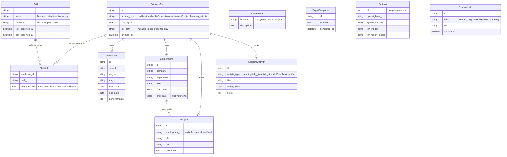
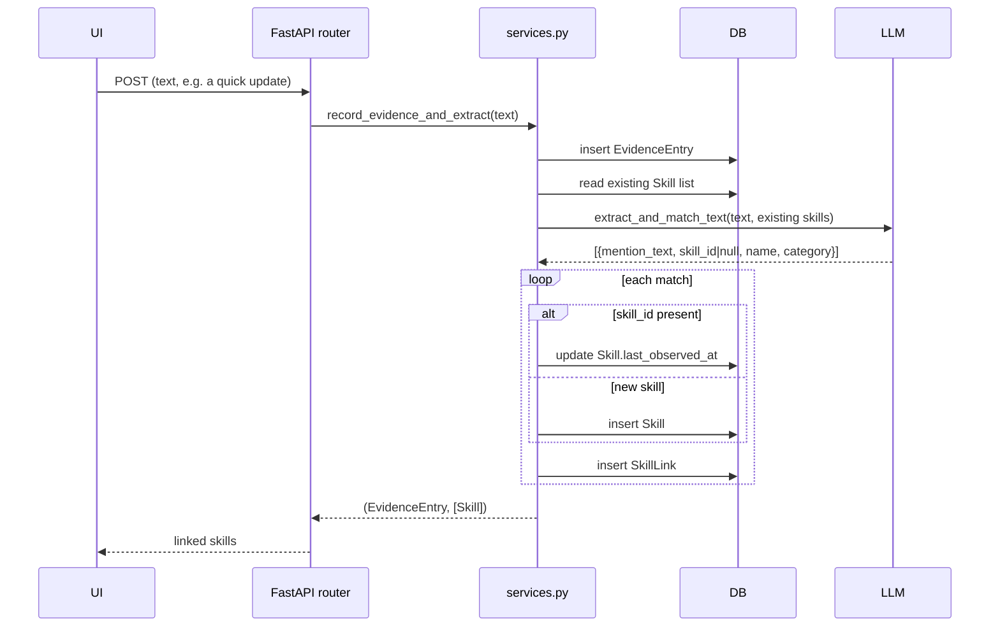

# Architecture

## Stack

- **Backend**: FastAPI + SQLModel (SQLite), Python 3.12. Talks to an
  OpenAI-compatible chat completions endpoint via the `openai` SDK.
- **Frontend**: Vue 3 + Vite + Element Plus + vue-router + vue-i18n +
  ECharts (via vue-echarts). Built to static assets and served by FastAPI in
  production (see `app/main.py`'s SPA fallback route and the multi-stage
  `Dockerfile`).
- **Data**: a single SQLite file at `data/skillgrowth.db`. No message queue,
  no background workers — every LLM call happens synchronously inside the
  request that triggered it.

## Data model

The evidence log is the source of truth. `Skill` is a materialized entity
derived from it, not recomputed on every read — this is what makes the skill
growth timeline and category charts possible without repeated LLM calls on
every page view.

## Evidence → skill extraction flow

Every entry point that accepts free text (the Dashboard's quick update box,
or the description field on Education/Employment/Project/LearningActivity)
goes through the same path: `app/services.py::record_evidence_and_extract`.
(Its `source_type` value in the database is still `"checkin"` — an internal
identifier, not shown to users.)

Certification images go through the analogous
`extract_and_match_image` path, which sends the image as a base64 data URL
to a vision-capable model instead of plain text.

Manually adding a skill from the Skills page (`POST /api/skills`), or
importing a `name,category` CSV (`POST /api/skills/import-csv`), bypasses
this pipeline entirely — both write `Skill` rows directly (through the same
`_upsert_skill` dedup helper in `app/routers/skills.py`), since there's no
free text to extract from. Resume parsing was deliberately not built: a
personal resume's layout varies too much for reliable LLM extraction, so
structured skill import goes through CSV instead.

`ExternalLink` (GitHub, X, note, Zenn, a personal blog, ...) is a plain
label+URL list with no evidence/LLM involvement — it's just a fact, not
something to extract skills from.

## Backup, restore, and sample data

`app/backup_import.py::import_backup` is shared by two endpoints:
`POST /api/backup/import` (a user-uploaded backup file) and
`POST /api/backup/load-sample` (the bundled `app/sample_data.json`, used to
populate a fresh install for exploration). Both take the same
backup-shaped dict that `GET /api/backup/export` produces.

Every imported row gets a **freshly generated id** — old ids from the
payload are only used as lookup keys, in per-request maps
(`evidence_id_map`, `skill_id_map`, `employment_id_map`), to remap foreign
keys (`SkillLink.evidence_id`/`skill_id`, `Education`/`Employment`/
`Project`/`LearningActivity.evidence_id`, `Project.employment_id`) onto the
new rows. This makes import purely additive and safe to run repeatedly:
nothing is ever deleted or updated by id. The one exception is
`CareerGoal`, which is keyed by `horizon` rather than `id` — import only
fills in a horizon whose `description` is still empty, so it can never
silently overwrite a goal the user has already written. `Settings` is
never part of the payload in either direction, so an LLM API key can't
leak through a backup file.

`load-sample` additionally passes a `track` dict into `import_backup`,
which the function fills with `{table_name: [new_id, ...]}` as it creates
each row (a horizon string for `career_goal` instead of an id, since that
table has no id). The router persists these as `SampleDataRecord` rows.
`POST /api/backup/reset-sample` reads all `SampleDataRecord` rows, deletes
exactly those ids from each real table (children before the rows they
reference — see `RESET_TABLE_ORDER` in `app/routers/backup.py`), blanks
the `description` of any tracked `CareerGoal` horizon, then deletes the
`SampleDataRecord` rows themselves. Running `load-sample` more than once
accumulates more tracked rows rather than overwriting the previous batch,
so `reset-sample` always undoes everything sample data has ever added, not
just the most recent load. The plain `POST /api/backup/import` path never
writes to `SampleDataRecord`, so restoring a real backup is never
reset-able this way — only sample data is.

## LLM error handling

Every `app/llm.py` function that calls the configured endpoint goes
through `_complete()`, which wraps `openai`'s SDK call and re-raises any
failure as `LLMRequestError` (a plain `RuntimeError` subclass — no
FastAPI/HTTP dependency inside `llm.py`). `app/main.py` registers a global
`@app.exception_handler(LLMRequestError)` that turns it into a `502` with
`{"detail": "LLM request failed: <reason>"}`. This is the single place
that decides how LLM failures look over HTTP — router code never needs
its own try/except for this, and the frontend's `api.js` already surfaces
any `detail` field from an error response, so the user sees the real
reason (e.g. an invalid API key) instead of a bare "Internal Server
Error". `test_connection()` is the one exception: it deliberately catches
errors itself and returns `{"ok": false, "message": ...}`, since Settings'
"Test connection" button is designed to report failure as data, not throw.

## AI Integration page (the only two LLM-optional features)

Every other advisory feature in the app happens without calling an LLM at
request time (extraction still uses one, at evidence-add time). The two
exceptions live together under `/api/ai` and the `/ai` page, so it's
obvious to the user which parts of the app talk to a model on demand:

`POST /api/ai/growth-guidance` reads all three `CareerGoal` rows (written
from the free-text goal fields on the Dashboard), drops any with an empty
`description` (goals are optional), and — only if at least one remains —
sends the non-empty goals plus the current skill list to
`llm.goal_growth_guidance`, which returns per-horizon advice. No goals set
means no LLM call.

`POST /api/ai/gap-check` takes a pasted job posting and compares it
against the current skill list the same way — matched vs. missing — just
with the target being a job posting instead of the user's own goals.

Both routers previously lived under `/api/goals` and `/api/export`
respectively; they were split out into `app/routers/ai.py` so that moving
or removing "the AI stuff" never means touching the goals or resume
routers.

## Resume export (no LLM)

`POST /api/export` calls `app/resume_builder.py::build_resume_markdown`,
which is pure and deterministic — no LLM, no network call. It builds a
fixed set of Markdown sections in a fixed order (Self PR → Work History →
Other Projects → Education → Skills → Certifications) directly from
`Employment`/`Project`/`Education`/`Skill`/`LearningActivity` rows; any
section with no data is omitted. This replaced an earlier LLM-based
`generate_resume()` — layout variance and hallucination risk weren't
worth it for a document meant to be copy-pasted as-is.

`SelfPR` is append-only, like evidence: `POST /api/self-pr` always inserts
a new row rather than editing one in place, `GET /api/self-pr` lists them
newest-first for display, and `build_resume_markdown` uses only the most
recent row's `content` for the "Self PR" section — so past drafts stay in
history without cluttering the generated resume.

## LLM configuration

`Settings` is a singleton DB row (id=1), editable from the Settings page. It
holds `openai_base_url` / `openai_api_key` / `llm_model` /
`llm_vision_model`. Because the app talks to any OpenAI-compatible chat
completions endpoint, the same code path works against OpenAI, a hosted
provider, or a local Ollama server exposing `/v1` — only the base URL and
model name change.

## Frontend routing

The SPA has one route per top-level concern (Dashboard, Profile, Learning,
Skills, Evidence log, Export, Settings), listed in
`frontend/src/router/index.js`. There's no server-side rendering; the
FastAPI catch-all route in `app/main.py` returns `index.html` for any
non-`/api` path so client-side routing (`vue-router`'s history mode) works
on a hard refresh.
