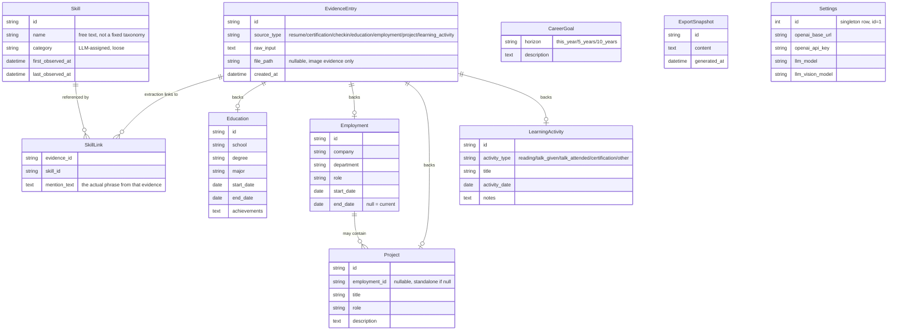
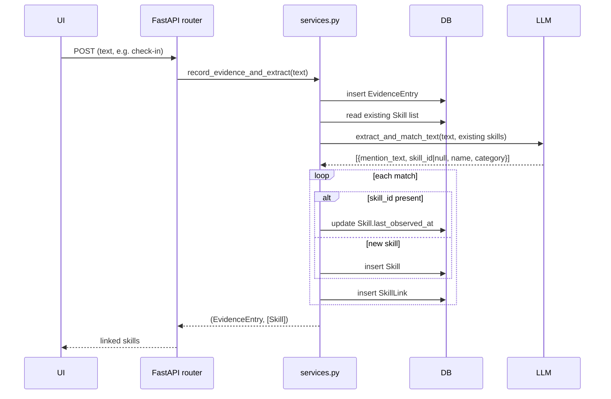

# Architecture

## Stack

- **Backend**: FastAPI + SQLModel (SQLite), Python 3.12. Talks to an
  OpenAI-compatible chat completions endpoint via the `openai` SDK.
- **Frontend**: Vue 3 + Vite + Element Plus + vue-router + vue-i18n +
  ECharts (via vue-echarts). Built to static assets and served by FastAPI in
  production (see `app/main.py`'s SPA fallback route and the multi-stage
  `Dockerfile`).
- **Data**: a single SQLite file at `data/skillgrowth.db`. No message queue,
  no background workers — every LLM call happens synchronously inside the
  request that triggered it.

## Data model

The evidence log is the source of truth. `Skill` is a materialized entity
derived from it, not recomputed on every read — this is what makes the skill
growth timeline and category charts possible without repeated LLM calls on
every page view.

## Evidence → skill extraction flow

Every entry point that accepts free text (check-in, resume import, or the
description field on Education/Employment/Project/LearningActivity) goes
through the same path: `app/services.py::record_evidence_and_extract`.

Certification images go through the analogous
`extract_and_match_image` path, which sends the image as a base64 data URL
to a vision-capable model instead of plain text.

Manually adding a skill from the Skills page (`POST /api/skills`) bypasses
this pipeline entirely — it writes a `Skill` row directly (with
case-insensitive name dedup), since there's no free text to extract from.

## LLM configuration

`Settings` is a singleton DB row (id=1), editable from the Settings page. It
holds `openai_base_url` / `openai_api_key` / `llm_model` /
`llm_vision_model`. Because the app talks to any OpenAI-compatible chat
completions endpoint, the same code path works against OpenAI, a hosted
provider, or a local Ollama server exposing `/v1` — only the base URL and
model name change.

## Frontend routing

The SPA has one route per top-level concern (Dashboard, Profile, Learning,
Skills, Evidence log, Export, Settings), listed in
`frontend/src/router/index.js`. There's no server-side rendering; the
FastAPI catch-all route in `app/main.py` returns `index.html` for any
non-`/api` path so client-side routing (`vue-router`'s history mode) works
on a hard refresh.
