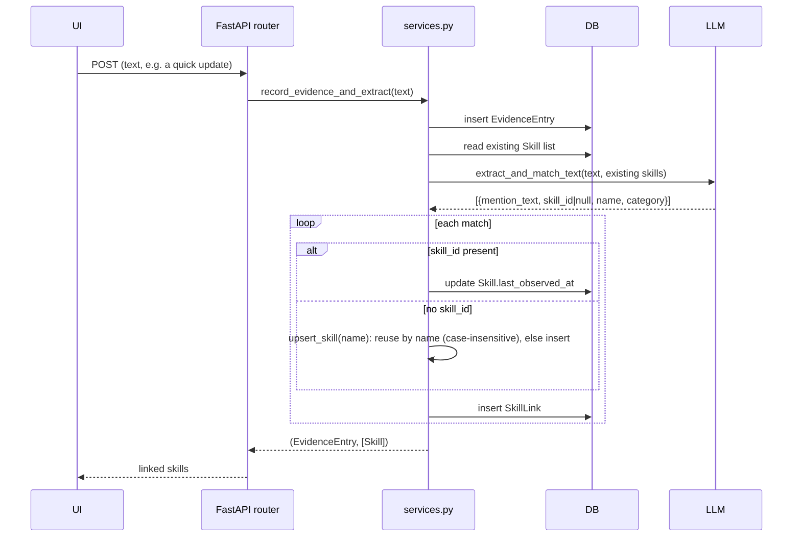

# Architecture

## Stack

- **Backend**: FastAPI + SQLModel (SQLite), Python 3.12. Talks to an
  OpenAI-compatible chat completions endpoint via the `openai` SDK.
- **Frontend**: Vue 3 + Vite + Element Plus + vue-router + vue-i18n +
  ECharts (via vue-echarts). Built to static assets and served by FastAPI in
  production (see `app/main.py`'s SPA fallback route and the multi-stage
  `Dockerfile`).
- **Data**: a single SQLite file at `data/skillgrowth.db`. No message queue,
  no background workers — every LLM call happens synchronously inside the
  request that triggered it.

`GET /api/health` runs a trivial `SELECT 1` against that SQLite file and
returns 200/503 accordingly — `GET /api/version` (just the `VERSION` file
contents) can't stand in for it, since it never touches the DB. The
`Dockerfile`'s `HEALTHCHECK` is the only place the check command lives
(stdlib `urllib` against `localhost:8000/api/health`, avoiding a `curl`
dependency); `docker-compose.yml` doesn't repeat it since Compose inherits
an image's `HEALTHCHECK` automatically.

`app/basic_auth.py::setup_basic_auth(app)` registers an HTTP Basic Auth
middleware only when both `SKILLGROWTH_BASIC_AUTH_USER` and
`SKILLGROWTH_BASIC_AUTH_PASS` are set in the environment (see README's
"Optional access gate") — unset, it's a no-op and every request is
unauthenticated, same as before this existed. Credentials are compared
with `secrets.compare_digest`, not `==`, to avoid a timing side-channel.
`/api/health` is explicitly exempted from the gate: it has no way to know
user-chosen credentials, and gating it would make the `Dockerfile`'s
`HEALTHCHECK` above start failing the moment this env-var gate is turned
on, even though the app itself is healthy.

## MCP server

`app/mcp_server.py::setup_mcp(app)` mounts an [MCP](https://modelcontextprotocol.io)
server at `/mcp` inside the same FastAPI process via the
[`fastapi-mcp`](https://github.com/tadata-org/fastapi_mcp) library, only
when `SKILLGROWTH_MCP_ENABLED` is set (see README's "Optional MCP
server") — unset, it's a no-op, same "opt-in, off by default" pattern as
`setup_basic_auth` above. A separate wrapper process was considered and
rejected: this app's one design principle that matters most here is
"single user, self-hosted, single process" (see the Concept page), and a
second process would duplicate startup, auth, and deployment for no
benefit an in-process mount doesn't already give.

`fastapi-mcp` builds its tool list from the app's OpenAPI schema, so
`setup_mcp(app)` must run **after** every `app.include_router(...)` call
(the schema has to be complete first) and **before** the SPA fallback
route at the bottom of `app/main.py` (a catch-all `GET /{full_path:path}`
that would otherwise shadow `/mcp`, since Starlette matches routes in
registration order).

**Tool selection** is an explicit whitelist, `MCP_OPERATIONS` in
`app/mcp_server.py`, passed as `FastApiMCP(..., include_operations=...)`.
Each listed id is a FastAPI `operation_id` set explicitly on its route
(fastapi-mcp's own recommendation — the auto-generated default is an
unreadable hash-like string); routes with no explicit `operation_id` are
simply never in the list, so nothing needs to be enumerated on the
exclude side. The whitelist deliberately covers only read, add, and
update operations — reading
(skills/activity/certifications/bookmarks/profile/portfolio/self
feedback/self PR/goals/vision) plus adding or updating those same
resources — and excludes:

- every `DELETE` endpoint (a wrong tool call must not be able to erase
  career data)
- `settings.py`/`backup.py` (API key and full-database export/import/reset)
- `ai.py`/`consult.py`/`evidence.py`/`resume_import.py` (LLM-only features,
  out of scope for "read and record your data")
- anything involving a multipart file upload (CSV import, certificate/photo/portfolio-file/template uploads) — not a good fit for an MCP tool's schema

Most of the included add/update tools (certifications, planned
certifications, skills, education/employment/projects) go through the
same `app/services.py::record_evidence_and_extract` path manual entry via
the web UI uses — when Settings' skill extraction is turned on, a tool
call therefore makes the same synchronous LLM round-trip the UI does
(observed around 30 seconds locally against Ollama), not a new cost MCP
introduces.

**Auth**: `setup_basic_auth`'s `@app.middleware("http")` wraps the app's
`router` object itself (not a frozen snapshot of the routes present at
registration time), so it covers `/mcp` automatically regardless of call
order — verified in `tests/test_mcp_server.py`'s
`test_mcp_protected_by_basic_auth_when_both_enabled`. fastapi-mcp's own
`auth_config` (a `Depends`-based alternative, for deployments with no
app-wide gate) is intentionally unused here.

**Dependency note**: `fastapi-mcp` 0.4.0 (latest on PyPI as of writing)
still calls the `mcp` SDK's 1.x `Server(name, description)` positional
constructor, which `mcp>=2.0` broke by making `description` keyword-only —
`requirements.txt` pins `mcp>=1.12.0,<2.0.0` until fastapi-mcp catches up
with the 2.x API. Without this pin, `setup_mcp(app)` raises a `TypeError`
at import time whenever the gate is enabled.

## Data model

The activity log (the `EvidenceEntry` table — the name predates the
user-facing "Activity" wording, but renaming it would touch every router,
service, and migration for no behavioral gain, so the class name stays)
is the source of truth. `Skill` is a materialized entity derived from it,
not recomputed on every read — this is what makes the skill growth
timeline and category charts possible without repeated LLM calls on every
page view.

```mermaid
erDiagram
  EvidenceEntry ||--o{ SkillLink : "extraction links to"
  Skill ||--o{ SkillLink : "referenced by"
  EvidenceEntry ||--o| Education : "backs"
  EvidenceEntry ||--o| Employment : "backs"
  EvidenceEntry ||--o| Project : "backs"
  EvidenceEntry ||--o| LearningActivity : "backs"
  Employment ||--o{ Project : "may contain"
  CareerGoal ||--o{ CareerGoalHistory : "past versions (matched by horizon, not a real FK)"
  ConsultSession ||--o{ ConsultMessage : "has"

  EvidenceEntry {
    string id
    string source_type "certification/checkin/education/employment/project/learning_activity"
    text raw_input
    string file_path "nullable, image evidence only"
    datetime created_at
  }
  Skill {
    string id
    string name "free text, not a fixed taxonomy"
    string category "LLM-assigned, loose"
    datetime first_observed_at
    datetime last_observed_at
    int proficiency "nullable, 1-5, set manually on the Skills page"
  }
  SkillLink {
    string evidence_id
    string skill_id
    text mention_text "the actual phrase from that evidence"
  }
  Education {
    string id
    string school
    string degree
    string major
    date start_date
    date end_date
    text achievements
  }
  Employment {
    string id
    string company
    string department
    string role
    date start_date
    date end_date "null = current"
  }
  Project {
    string id
    string employment_id "nullable, standalone if null"
    string title
    string role
    text description
  }
  LearningActivity {
    string id
    string activity_type "free text matching an ActivityType.label at creation time, not a FK"
    string title
    date activity_date
    date expiry_date "optional, only meaningful for activity_type=='certification'"
    text notes
    bool include_in_resume "for certification: resume Certifications filter. For other types: fine exclusion on top of ActivityType.include_in_resume's type-level gate"
  }
  ActivityType {
    string id
    string label "shown in the Activity type picker; what new entries' activity_type gets set to"
    bool is_protected "true only for the seeded 'certification' row — can't be renamed/deleted"
    string translation_key "learning.type* i18n key for the seeded defaults; cleared on rename"
    datetime created_at
    bool include_in_resume "default false — type-level gate for the resume's Activities & Links section"
  }
  SelfFeedback {
    string id
    date entry_date "user-chosen, not evidence-linked or extracted"
    text accomplishments "やったこと"
    text reflection "所感・反省"
    text next_steps "次に活かすこと"
    datetime created_at
    datetime updated_at
  }
  CareerGoal {
    string horizon "this_year/5_years/10_years, primary key"
    text description "current value only"
    bool include_in_resume "default false — opt-in, see 'Resume export (no LLM)'"
  }
  CareerGoalHistory {
    string id
    string horizon "this_year/5_years/10_years"
    text description
    datetime created_at
  }
  CareerVision {
    int id "singleton row, id=1"
    text content "no history — overwritten in place"
    datetime updated_at
    bool include_in_resume "default false — opt-in, see 'Resume export (no LLM)'"
  }
  PersonalValues {
    int id "singleton row, id=1"
    text content "no history — overwritten in place"
    datetime updated_at
    bool include_in_resume "default TRUE — brand-new field, nothing to surprise on upgrade"
  }
  ConsultSession {
    string id
    text title "set from the first message"
    string target_industry "optional, set only at creation; specializes this session's advice"
    datetime created_at
    datetime updated_at
  }
  ConsultMessage {
    string id
    string session_id
    string role "user or assistant"
    text content
    datetime created_at
  }
  ExportSnapshot {
    string id
    text content
    datetime generated_at
  }
  ResumeTemplate {
    string id
    string name
    string file_path "uploaded .docx, on disk"
    string section_formats "JSON text: per-section bullet/table or list/table choice"
    bool is_selected
    datetime uploaded_at
  }
  ResumeMdTemplate {
    string id
    string name
    string file_path "uploaded .md, on disk"
    string section_formats "JSON text: per-section bullet/table or list/table choice"
    bool is_selected
    datetime uploaded_at
  }
  PersonalInfo {
    int id "singleton row, id=1"
    string name
    string name_kana
    date birthdate "nullable"
    string postal_code
    string address
    string address_kana
    string phone
    string email
    string photo_path "nullable, uploaded image on disk"
    datetime updated_at
  }
  RirekishoTemplate {
    string id
    string name
    string file_path "uploaded .docx, on disk"
    bool is_selected
    datetime uploaded_at
  }
  Settings {
    int id "singleton row, id=1"
    string openai_base_url
    string openai_api_key
    string llm_model
    string llm_vision_model
    string consult_custom_instructions "appended to CONSULT_SYSTEM_PROMPT for Career Consult only"
  }
  ExternalLink {
    string id
    string label "free text, e.g. GitHub/X/note/Zenn/Blog"
    string url
    datetime created_at
    bool include_in_resume "default false — opt-in, feeds the resume's Activities & Links section"
  }
  PlannedCertification {
    string id
    string title
    string status "considering | planned — checked in the router, not the schema"
    date target_date "nullable"
    text notes
    datetime created_at
  }
  Bookmark {
    string id
    string url
    string title "manually entered, no automatic fetch"
    text memo
    datetime created_at
  }
  Project ||--o{ PortfolioItem : "optional, standalone projects only"
  PortfolioItem ||--o{ PortfolioLink : "has"
  PortfolioItem ||--o{ PortfolioFile : "has"
  PortfolioItem {
    string id
    string title
    text description "free text — deliberately NOT run through skill extraction"
    string project_id "nullable FK to Project; must be standalone (employment_id IS NULL)"
    datetime created_at
    bool include_in_resume "default false — opt-in, feeds the resume's Activities & Links section"
  }
  PortfolioLink {
    string id
    string portfolio_item_id
    string label
    string url
    datetime created_at
  }
  PortfolioFile {
    string id
    string portfolio_item_id
    string original_filename
    string file_path "uploaded file, on disk, 10MB cap, PDF/spreadsheet/photo allowlist"
    string content_type
    int size_bytes
    datetime uploaded_at
  }
```

`Skill.proficiency` is one of two fields on this diagram that aren't
derived from activity (the other is `PersonalValues.content`, a few
entities below) — the Concept page states "activity-based, not
self-assessment" as a design principle, and a manually-set 1-5 rating is
exactly a self-assessment. It's a deliberate, scoped exception rather
than an oversight: reviewers asked for a way to see skill level at a
glance, and nothing in the activity log (evidence count, first/last
observed date) reliably stands in for it. Left `null` until the user
sets it on the Skills page; an automatic re-match of an existing skill
(CSV import, activity extraction) never touches it, the same as it
already leaves `category` alone on that path.

`PersonalValues.content` is the second such exception — see "Resume
export (no LLM)" below for why it needed one.

## Skill Network graph

The ER diagram above already documents which entities relate to which —
`GET /api/graph` (`app/routers/graph.py`) is what actually surfaces those
relationships to the user, as a node/edge graph rendered on the
Skill Network page (`frontend/src/views/Connections.vue` — the
user-facing name changed, the component file didn't — using ECharts'
`GraphChart` with `layout: 'force'`).

Deliberately **not every entity is a node**: `EvidenceEntry` is this app's
one append-only, unbounded-growth table (see "Activity ⨯ Learning Log
merge" below and the Activity page's own docs) — the same property that
made the old cumulative skill-growth timeline a bad chart (replaced with
a monthly bar chart; see the Changelog). A graph that put every checkin
and every non-certification `LearningActivity` on screen would grow into
an unreadable tangle the longer someone used the app, which defeats the
point of a feature meant to make connections *clearer*. So the graph only
includes entities that are inherently bounded — a career has a finite
number of jobs, degrees, projects, portfolio pieces, and certifications,
even after years of use:

- `Skill` (all)
- `LearningActivity` where `activity_type == "certification"` only —
  reading/talks/other activity types are excluded
- `Education`, `Employment`, `Project` (all)
- `PortfolioItem` (all)

Edges come from existing foreign keys with no new schema: `Project.
employment_id` and `PortfolioItem.project_id` give the structural edges;
`SkillLink.evidence_id` gives the skill edges, but only when that
`evidence_id` resolves to one of the node types above (a `SkillLink` whose
evidence is a checkin or a non-certification activity simply produces no
edge — there's no separate filter needed, since building the
`evidence_id → node id` map before the `SkillLink` pass naturally excludes
anything without a matching node).

## Schema changes with no migration tool

There's no Alembic (or any other migration framework) — `app/db.py::init_db()`
calls `SQLModel.metadata.create_all(engine)`, which only creates tables that
don't exist yet. It never alters a table that's already on disk. A brand
new install always gets the full current schema for free; a self-hosted
instance with real data in `data/skillgrowth.db` does not — a column added
to a model shows up in every *new* row's INSERT statement the moment the
code deploys, but the on-disk table still lacks it, so the very next write
crashes with `no such column`.

This actually happened when `ExportSnapshot.edited_at` was added (to
support editing a past resume snapshot): fresh installs were fine, but any
instance that had already generated a resume crashed the next time it
tried to. The fix is `app/db.py::_ensure_column(engine, table, column,
ddl_type)` — checked via `PRAGMA table_info`, and only runs `ALTER TABLE
... ADD COLUMN` if the column is actually missing, so it's a no-op on a
fresh install and a real fix on an upgraded one. `init_db()` calls it once
per column that's been added after its table already shipped. **Any new
nullable column on an existing table needs a matching `_ensure_column`
call here** — a new table doesn't (`create_all()` handles that case
correctly on its own). `SelfPR.is_selected` and `Skill.include_in_resume`
were added the same way, each with its own `_ensure_column` call and each
given a SQL `DEFAULT` (`0`/`1` respectively) — with `DEFAULT 1` in
particular, SQLite backfills that value onto every existing row when the
column is added, which is exactly the "every skill you already have keeps
showing on the resume" behavior an upgraded install needs, without a
separate backfill step.

## Full-text search

`search_index` is a SQLite FTS5 virtual table, deliberately kept outside
SQLModel entirely rather than becoming a `table=True` model — `create_all()`
only knows how to create ordinary tables, and a `Skill`/`LearningActivity`/
`PortfolioItem` row already has a real primary key elsewhere, so mapping
FTS5's rowid-based virtual table onto SQLModel would fight the ORM for no
benefit. It's created and kept in sync by `app/db.py::_ensure_search_index`,
which every path that can create or reset the schema must call explicitly
(`init_db()`, and `backup.py::reset_all_data` — see below) since nothing
discovers it automatically the way `create_all()` discovers `table=True`
classes.

Sync is trigger-based rather than routed through each of
`app/routers/skills.py`/`learning.py`/`portfolio.py`: nine SQL triggers
(INSERT/UPDATE/DELETE × the three source tables) mirror `name`/`category`,
`title`/`notes`, and `title`/`description` into `search_index` at the
SQLite level, so every write path — including `app/backup_import.py`'s
bulk restore, which none of those routers touch — stays in sync for free.
`_ensure_search_index` also does a one-time `DELETE` + re-`INSERT` full
rebuild from the three source tables every time it runs; on a fresh
install this is a no-op, but it's what backfills an existing install's
already-on-disk data the first time it upgrades to this feature (a
different problem than "Schema changes with no migration tool" above,
which is about columns on tables that already exist — this is a table
that doesn't exist as far as SQLModel is concerned at all).

`backup.py::reset_all_data`'s `drop_all`/`create_all` pair is why it needs
its own `_ensure_search_index` call: dropping `skill`/`learningactivity`/
`portfolioitem` also drops the triggers SQLite attached to them (dropping a
table always drops its triggers), and since `search_index` and the
triggers aren't SQLModel-mapped, `create_all()` never recreates them —
without the extra call, search would silently stop updating after every
"Reset all data."

`GET /api/search` (`app/routers/search.py`) quotes and prefix-matches each
whitespace-split token (`"term"*`) before handing the query to FTS5's
`MATCH`, so raw user input containing FTS5 operator syntax (`-`, `"`,
`NEAR`, ...) can't be misinterpreted as a query operator; a `MATCH` syntax
error that slips through anyway degrades to an empty result list rather
than a 500.

## Evidence → skill extraction flow

Every entry point that accepts free text (the Dashboard's quick update box,
or the description field on Education/Employment/Project/LearningActivity)
goes through the same path: `app/services.py::record_evidence_and_extract`.
(Its `source_type` value in the database is still `"checkin"` — an internal
identifier, not shown to users.)

```mermaid
sequenceDiagram
  participant UI
  participant API as FastAPI router
  participant Svc as services.py
  participant DB
  participant LLM

  UI->>API: POST (text, e.g. a quick update)
  API->>Svc: record_evidence_and_extract(text)
  Svc->>DB: insert EvidenceEntry
  Svc->>DB: read existing Skill list
  Svc->>LLM: extract_and_match_text(text, existing skills)
  LLM-->>Svc: [{mention_text, skill_id|null, name, category}]
  loop each match
    alt skill_id present
      Svc->>DB: update Skill.last_observed_at
    else no skill_id
      Svc->>Svc: upsert_skill(name): reuse by name (case-insensitive), else insert
    end
    Svc->>DB: insert SkillLink
  end
  Svc-->>API: (EvidenceEntry, [Skill])
  API-->>UI: linked skills
```

Certification images go through the analogous
`extract_and_match_image` path, which sends the image as a base64 data URL
to a vision-capable model instead of plain text. A `.pdf` upload is
converted to one first before reaching this path: `app/routers/evidence.py`
rasterizes page 1 with `pymupdf` and writes the result as a `.png`, so the
extraction code and `EvidenceEntry.file_path` never see anything but image
files. Only page 1 is used — this upload has always been a single image,
never a multi-page document.

Manually adding a skill from the Skills page (`POST /api/skills`), or
importing a `name,category` CSV (`POST /api/skills/import-csv`), bypasses
this pipeline entirely — both write `Skill` rows directly (through the same
`upsert_skill` dedup helper in `app/services.py`), since there's no
free text to extract from.

### Resume import (draft-only, never auto-committed)

Full resume parsing was deliberately not built for a long time: a personal
resume's layout varies too much for reliable LLM extraction. The
reconsideration (see "Portfolio backup" above for the same kind of
documented-constraint-first design) landed on a narrower version of the
feature rather than reversing the original call outright:
`POST /api/resume-import/extract` (`app/routers/resume_import.py`) reads an
uploaded `.docx` (via `python-docx`) or `.pdf` (via `pymupdf`'s text
extraction — no OCR, so a scanned/image-only PDF is rejected the same way
an empty `.docx` is) and calls `llm.extract_resume`, which asks the model
for `education`/`employment`/
`projects`/`skills`/`certifications`/`self_pr` as one JSON object — and
returns that draft to the caller as-is. **Nothing is written to the DB and
the uploaded file is never saved to disk**; the frontend (`ResumeImport.vue`)
shows the draft for the user to edit and deselect items, then creates each
confirmed item through the *existing* `POST /api/profile/education`,
`/api/profile/employment`, `/api/profile/projects`, `/api/learning`
(`activity_type: "certification"`), and `/api/self-pr` endpoints — so every
invariant those already enforce (the standalone-project rule, etc.) applies
automatically, and no second write path for any of those models had to be
built.

**Skills are linked to the project(s) they came from, not registered as a
flat list.** Every other `Skill` in this app traces back to a `SkillLink`
row pointing at an `EvidenceEntry` (see "Evidence → skill extraction flow"
above) — it was derived from something the user actually logged.
`llm.extract_resume`'s prompt asks each skill for `project_indices` (the
0-based indices into its own `projects` array that mention it); the draft
UI only offers a skill for registration if that list is non-empty (an
empty list means the resume's dedicated skills section mentioned it but no
individual project description did — shown as a reference-only tag
instead, registerable by hand from the Skills page if wanted).
Confirming a linked skill calls `POST /api/resume-import/link-skill`
(`{project_id, name, category}`) once per linked project: it resolves
`project_id` to that `Project`'s own `evidence_id`, upserts the `Skill`
(`services.upsert_skill`, the same dedup every other skill-creating path
uses), and adds a `SkillLink` on that `evidence_id` if one doesn't already
exist — `app/routers/graph.py` draws a Skill→Project edge precisely when a
`SkillLink.evidence_id` matches a `Project.evidence_id`, so this is what
makes an imported skill actually show up connected in the Skill Network.
Deliberately independent of `Settings.skill_extraction_enabled`: that
setting gates *passive* extraction from free text the user didn't
explicitly ask to be parsed (a quick update, a project's own description on
create); this is a human confirming an already-reviewed, already-extracted
skill, not a new LLM call, so it isn't gated the same way.

Three things learned from testing this against a real resume on a local
model (an Ollama-served model over its OpenAI-compatible endpoint) shaped
the design:
- `document.paragraphs` (python-docx's obvious entry point) silently skips
  any paragraph inside a table — and a real resume's period-by-period
  project history is commonly laid out as a Word table (confirmed directly:
  a real test resume had its entire 15-row project history in two tables,
  reading `.paragraphs` alone surfaced almost none of it). `_document_text`
  walks `document.element.body`'s children directly (`w:p` and `w:tbl`), so
  table rows are read in their original position among the surrounding
  paragraphs, not dropped or appended out of order.
- Without `response_format={"type": "json_object"}` on the completion
  request, a schema this wide (six arrays in one response) produced
  syntactically broken JSON in testing; with it, it didn't. `extract_resume`
  passes that parameter — the only one of this file's LLM calls that does,
  since the others return much smaller JSON shapes that haven't shown the
  same failure mode.
- Projects are linked to an employment by `employer_index` (the employment
  array's 0-based position), not by repeating the company name — an LLM
  asked to copy a company name verbatim doesn't always do so consistently
  (seen in testing: "Acme Corp" vs. "Acme Corp (formerly Acme Inc.)" across
  runs), which breaks a string-match join. An index into a list the model
  itself just generated has nothing to misspell.

Only `.docx` and `.pdf` are accepted (400 on anything else) — legacy
binary `.doc` still isn't, since reading it would need LibreOffice/
`soffice`, and this repo's Docker image doesn't carry one (not worth the
image size for this feature alone). `.pdf` support didn't need that
tradeoff: `pymupdf` is a pure wheel with no system package, so it was
added for both this endpoint's text extraction and the certification
upload's page rasterization above.

`upsert_skill` is the single place that enforces "`Skill.name` is unique
case-insensitively": it's shared by the LLM-extraction path above, manual
add, and CSV import, all of which create a `Skill` on a user's behalf. The
LLM is only given existing skill names (not guaranteed to echo back the
matching `skill_id`), so the no-`skill_id` branch above must look the name
up case-insensitively rather than insert unconditionally — otherwise an LLM
response like `{"skill_id": null, "name": "python"}` would silently create a
case-duplicate of an existing `"Python"`. This is deliberately *not* a
DB-level constraint, since a SQL `UNIQUE` index would apply to every writer
with no way to exempt one: `app/backup_import.py` restores `Skill` rows
verbatim from a snapshot and is meant to stay exempt — re-importing a
backup that overlaps with current data is expected to produce duplicate
rows, not merge them (see `tests/test_backup_api.py`'s round-trip test).

`PUT /api/skills/{id}` edits an existing `Skill`'s `name`/`category` in
place (404 if the id doesn't exist) — for fixing an LLM extraction mistake
without losing the skill's accumulated `SkillLink`s, first/last-observed
dates, or evidence count, which a delete-and-re-add would reset. It runs
the same case-insensitive collision check as `upsert_skill`, but rejects
(400) rather than merges if the new name matches a *different* existing
skill, since silently merging two skills' evidence together is a bigger
decision than a simple rename and isn't something this endpoint does.

`Skill.include_in_resume` (default `True`) is a separate, narrower toggle:
`PUT /api/skills/{id}/resume-inclusion` flips it without touching
name/category, and `build_resume_markdown`'s Skills-section query is the
only place that filters on it. Turning it off doesn't remove the skill
from anywhere else — the current-skill view, the Dashboard's action
chart, gap checks against it — it only means the resume template skips
it, since
"I want to track this" and "I want a stranger reading my resume to see
this" are different decisions.

`ExternalLink` (GitHub, X, note, Zenn, a personal blog, ...) is a plain
label+URL list with no evidence/LLM involvement — it's just a fact, not
something to extract skills from.

`Bookmark` (links to Qiita/Zenn articles, etc. worth keeping) is the same
kind of plain fact as `ExternalLink` — a flat list with no evidence/LLM
involvement — just shaped for an unlabeled personal reading list (URL,
manually entered title, free-text memo) instead of a labeled set of
profile links.

`PlannedCertification` is a certification the user is considering or has
scheduled to take — deliberately a separate table from `LearningActivity`,
which only models already-*earned* certifications (the resume's
Certifications section, the Skill Network graph node, and the Activity
feed's certification filter all assume that). `POST
/api/planned-certifications/{id}/promote` converts a candidate into a
regular certification: it creates a new `LearningActivity`
(`activity_type="certification"`) through the same
`services.record_evidence_and_extract` path manual entry uses — so the
result is indistinguishable from a hand-added certification, complete with
its own `EvidenceEntry` and skill extraction — then deletes the
`PlannedCertification` row. This is a one-way conversion done in a single
endpoint rather than the frontend issuing a create-then-delete pair, so a
dropped connection mid-promotion can't leave both a new certification and
the original candidate behind.

## Backup, restore, and sample data

`app/backup_import.py::import_backup` is shared by two endpoints:
`POST /api/backup/import` (a user-uploaded backup file) and
`POST /api/backup/load-sample` (the bundled `app/sample_data.json`, used to
populate a fresh install for exploration). Both take the same
backup-shaped dict that `GET /api/backup/export` produces.

Every imported row gets a **freshly generated id** — old ids from the
payload are only used as lookup keys, in per-request maps
(`evidence_id_map`, `skill_id_map`, `employment_id_map`), to remap foreign
keys (`SkillLink.evidence_id`/`skill_id`, `Education`/`Employment`/
`Project`/`LearningActivity.evidence_id`, `Project.employment_id`) onto the
new rows. This makes import purely additive and safe to run repeatedly:
nothing is ever deleted or updated by id. The one exception is
`CareerGoal`, which is keyed by `horizon` rather than `id` — import only
fills in a horizon whose `description` is still empty, so it can never
silently overwrite a goal the user has already written. `CareerVision`
(see "Career vision" below) and `PersonalValues` (see "Resume export (no
LLM)" above) get the same treatment, each keyed by its fixed `id=1`
instead of a horizon. `CareerGoalHistory` rows (see "Career goal
history" below) are plain insert-only records like `SelfPR`, so every
imported row is simply added. `SelfFeedback` is the same — plain
insert-only, no dedup. `ActivityType` is the other exception: deduped by
`label` (case-insensitive), not always inserted — needed because
`app.db.init_db` already seeds the 5 default types on any normally
initialized install, so an unconditional insert would double them on
every restore; `is_protected`/`translation_key` are never taken from
backup data, since those are this app's own invariants, not user data a
backup should be able to grant or revoke. `Settings` is never part of the
payload in either direction, so an LLM API key can't leak through a
backup file.

Unlike `reset-all`'s `drop_all`/`create_all` below, `export_backup`,
`import_backup`, and `RESET_TABLE_ORDER` each hand-list every table they
touch rather than discovering them automatically — adding a table (as
`PlannedCertification` and `Bookmark` did) means updating all three by
hand, or its rows silently never make it into an export/import/reset-sample.

`load-sample` additionally passes a `track` dict into `import_backup`,
which the function fills with `{table_name: [new_id, ...]}` as it creates
each row (a horizon string for `career_goal`, the literal string `"1"` for
`career_vision`/`personal_values`, instead of an id, since none of those
tables has a real id column that fits this shape). The
router persists these as `SampleDataRecord` rows. `POST
/api/backup/reset-sample` reads all `SampleDataRecord` rows, deletes
exactly those ids from each real table (children before the rows they
reference — see `RESET_TABLE_ORDER` in `app/routers/backup.py`), blanks
the `description` of any tracked `CareerGoal` horizon and the `content` of
`CareerVision`/`PersonalValues` if tracked, then deletes the
`SampleDataRecord` rows
themselves. Running `load-sample` more than once
accumulates more tracked rows rather than overwriting the previous batch,
so `reset-sample` always undoes everything sample data has ever added, not
just the most recent load. The plain `POST /api/backup/import` path never
writes to `SampleDataRecord`, so restoring a real backup is never
reset-able this way — only sample data is.

`app/routers/backup.py::sample_record_ids(session, table_name)` exposes
the same `SampleDataRecord` lookup for read paths, not just
`reset-sample`: `GET /api/skills` and `GET /api/evidence` each call it
once per request and add `"is_sample": bool` to every row, so the
frontend (Skills list, Activity feed) can tag sample-sourced rows while
they're still visible, not just discover they existed once
`reset-sample` removes them. Scoped to these two screens for now — the
same helper can cover more list endpoints later if wanted.

`POST /api/backup/reset-all` is a different, much blunter operation:
`SQLModel.metadata.drop_all(bind)` + `create_all(bind)`, re-seeding only
the `Settings` singleton and the 5 default `ActivityType` rows — the
same starting point a fresh install gets, `Settings` included (unlike
every other path in this section, which deliberately never touches
`Settings`). Uploaded files under `PORTFOLIO_DIR`/`RESUME_TEMPLATE_DIR`
are deleted too, since the rows referencing them are gone.

Critically, this operates on `session.get_bind()` — the engine the
current request's `session` is actually bound to — never the
module-level `app.db.engine` directly. Code that reaches for that
module-level engine instead bypasses the `get_session` override
`tests/conftest.py` uses to isolate every test on its own in-memory
engine; a route that does this doesn't just fail to be testable, it
runs its DDL and reseeding against the *real* `data/skillgrowth.db` any
time a test happens to exercise it, wiping actual data as a side effect
of running the test suite. `init_db()` couldn't be reused for the
reseed step for the identical reason — it hardcodes `app.db.engine`
internally, the same way — so the reseed here is a few lines of its own
against `bind` instead of a call to it.

## LLM error handling

Every `app/llm.py` function that calls the configured endpoint goes
through `_complete()`, which wraps `openai`'s SDK call and re-raises any
failure as `LLMRequestError` (a plain `RuntimeError` subclass — no
FastAPI/HTTP dependency inside `llm.py`). `app/main.py` registers a global
`@app.exception_handler(LLMRequestError)` that turns it into a `502` with
`{"detail": "LLM request failed: <reason>"}`. This is the single place
that decides how LLM failures look over HTTP — router code never needs
its own try/except for this, and the frontend's `api.js` already surfaces
any `detail` field from an error response, so the user sees the real
reason (e.g. an invalid API key) instead of a bare "Internal Server
Error". `test_connection()` is the one exception: it deliberately catches
errors itself and returns `{"ok": false, "message": ...}`, since Settings'
"Test connection" button is designed to report failure as data, not throw.

## Career goal history

`CareerGoal` (keyed by `horizon`) still holds only the current value, so
reads stay a 3-row lookup. `PUT /api/goals/{horizon}` additionally writes
a `CareerGoalHistory` row, but only when `description` actually differs
from the stored value — saving with no changes (e.g. an edit that's
immediately cancelled, which never calls this endpoint at all) never
creates a duplicate entry.

`horizon` must be one of `app/routers/goals.py`'s `HORIZONS` (400 otherwise)
— every reader (`list_goals`, `app/career_context.py::build_consult_context`)
looks it up against that same fixed 3-value set, so an unrecognized value
would just become a permanently invisible row rather than anything any
page or prompt ever shows. `app/backup_import.py`'s `career_goals` loop
checks the same set before restoring a row, for the same reason.

`GET /api/goals/history` takes an optional `horizon` filter plus
`limit`/`offset` (default `limit=5`), the same shape as every other
paginated list in this app (`evidence`, `export`, `self-pr`). The
Dashboard never fetches history eagerly: each goal's "History" link is
closed by default, and clicking it fires the first page for that one
horizon only, with a "Load more" button for further pages. This matters
more here than elsewhere, since — unlike the activity log or resume
snapshots, which grow from occasional, deliberate actions — a career goal
can accumulate a history row on every save, including small wording
tweaks, so an eagerly-fetched unbounded list was the more likely one to
actually get long in practice.

## Career vision (no history, deliberately)

`CareerVision` is a plain singleton (id=1, the same pattern `Settings`
uses) rather than another `horizon`-keyed row on `CareerGoal`, since it's
conceptually a different, looser kind of content — one free-form
paragraph, not three time-boxed answers. `PUT /api/vision` overwrites
`content` in place; unlike `CareerGoal`, there's no history table backing
it, since nothing asked for one — if that changes, the shape would mirror
`CareerGoalHistory` exactly. `GET /api/vision` returns a blank
`CareerVision(id=1)` (never persisted) when no row exists yet, so the
frontend never has to special-case "no vision set."

## AI Career Support page (the only LLM-optional features)

Every other advisory feature in the app happens without calling an LLM at
request time (extraction still uses one, at evidence-add time). These
exceptions live together under `/api/ai` (plus `/api/consult` for Career
Consult, kept as its own router since it's a materially different shape
— see below) and the `/ai` page, so it's obvious to the user which parts
of the app talk to a model on demand:

`POST /api/ai/growth-guidance` reads all three `CareerGoal` rows (written
from the free-text goal fields on the Dashboard), drops any with an empty
`description` (goals are optional), and — only if at least one remains —
sends the non-empty goals plus the current skill list to
`llm.goal_growth_guidance`, which returns per-horizon advice. No goals set
means no LLM call.

`POST /api/ai/gap-check` takes a pasted job posting and compares it
against the current skill list the same way — matched vs. missing — just
with the target being a job posting instead of the user's own goals.

Both routers previously lived under `/api/goals` and `/api/export`
respectively; they were split out into `app/routers/ai.py` so that moving
or removing "the AI stuff" never means touching the goals or resume
routers.

## Career Consult (multi-turn, unlike the rest of the app's LLM calls)

Every other LLM-backed feature in this app is a single request/response —
one call in, one structured result out, nothing kept between calls.
Career Consult is the first genuinely stateful one: a chat with an AI
career consultant, where the whole point is that it remembers what was
already said. Two tables back it, in `app/routers/consult.py`:
`ConsultSession` (id, `title`, `created_at`, `updated_at`) and
`ConsultMessage` (id, `session_id`, `role` — `"user"` or `"assistant"` —
`content`, `created_at`). Both are new tables, so no `_ensure_column`
migration was needed for them.

`POST /api/consult/sessions/{id}/messages` does four things in order:
1. Saves the user's message and commits immediately — before calling the
   LLM at all — so a failed reply (bad connection, rate limit, whatever)
   never loses what the user typed. This is the same "commit first, then
   attempt the risky part" ordering `services.record_evidence_and_extract`
   already uses for evidence extraction.
2. Re-reads the session's full message history and hands it to
   `llm.career_consult_reply` as the OpenAI-style `messages` list — the
   entire conversation is resent on every turn, since this app has no
   context-window management or summarization. A very long-running
   conversation will eventually hit the configured model's context limit;
   nothing here handles that case today.
3. Builds a context block via `app/career_context.py::build_consult_context`
   — the same `build_resume_markdown` output the resume uses (skills,
   work history, education, Self PR), plus Vision and career path goals
   appended, which the resume deliberately leaves out but a career
   consultant needs. This whole block is injected into the system prompt
   (`llm.CONSULT_SYSTEM_PROMPT`) fresh on every message, not just once at
   session start, so the AI's picture of the user is never stale even
   mid-conversation.
4. Saves the assistant's reply, bumps `ConsultSession.updated_at` (so the
   session list on the AI Career Support page sorts by recency), and sets
   `title` from the first ~40 characters of the first user message if it
   wasn't already set.

Sessions are listed/fetched/deleted like every other paginated resource
in this app (`limit`/`offset` on the list endpoint); deleting a session
cascades to its messages in the router itself (no ON DELETE CASCADE at
the DB level, consistent with how `DELETE /api/skills/{id}` handles its
`SkillLink` rows). Both tables are included in backup export/import,
with `ConsultMessage.session_id` remapped through a fresh id map on
import — the same pattern used for every other foreign-keyed table.

`Settings.consult_custom_instructions` (edited from a collapsed
"Customize this consultant" field on the AI Career Support page) is appended
to `CONSULT_SYSTEM_PROMPT` via a `__CUSTOM_INSTRUCTIONS__` placeholder,
read directly off the `settings` object `career_consult_reply` already
receives — no signature change, no new call site. When the field is
empty, the placeholder is replaced with an empty string rather than
leaving it blank-but-present, so no stray marker or extra blank line ever
reaches the LLM. Deliberately not exposed for `gap_check`/
`goal_growth_guidance`: both parse a strict JSON shape out of the reply
(`_parse_json_object`), and a user-edited prompt could easily break that
contract; Career Consult's reply is free-form chat, so there's no
parsing contract to break.

## Resume export (no LLM)

`POST /api/export` calls `app/resume_builder.py::build_resume_markdown`,
which is pure and deterministic — no LLM, no network call. It builds a
fixed set of Markdown sections in a fixed order (Self PR → Vision →
Career Goals → Work History → Other Projects → Education → Skills →
Certifications → Activities & Links → Personal Values) directly from
`Employment`/`Project`/`Education`/`Skill`/`LearningActivity` rows; any
section with no data is omitted. This replaced an earlier LLM-based
`generate_resume()` — layout variance and hallucination risk weren't
worth it for a document meant to be copy-pasted as-is.

**Vision and Career Goals are opt-in**, unlike every other section here:
`CareerVision.include_in_resume`/`CareerGoal.include_in_resume` (added
via `_ensure_column`, both `BOOLEAN DEFAULT 0`) gate whether
`gather_resume_context` returns non-`None`/non-empty `vision`/`goals`
keys at all — `build_resume_markdown` then applies the same
"omit if empty" guard it already uses for every other section, so a
blank Vision stays omitted even with the toggle on. The default is
`False`, the opposite of `Skill.include_in_resume`/
`LearningActivity.include_in_resume`'s `True` default: those two were
already showing on the resume before their toggle existed, so flipping
the default to `False` would have silently hidden data every existing
install already had on their resume. Vision and Career Goals are the
reverse case — `app/career_context.py::build_consult_context` has always
read them for Career Consult, but `gather_resume_context` never did, so
defaulting the new toggle to `True` would make previously-internal
content start appearing on an upgraded install's resume without the user
ever asking for that. `PUT /api/vision/resume-inclusion` and
`PUT /api/goals/{horizon}/resume-inclusion` are the toggle endpoints —
narrow and separate from the content-editing `PUT`s, the same
"don't touch the content" shape `PUT /api/skills/{id}/resume-inclusion`
already uses, and (for goals) deliberately not routed through
`update_goal`'s `CareerGoalHistory` write, since toggling visibility
isn't a change to the goal's description.

**Activities & Links is a single combined section** drawing from three
tables that were already being recorded but that no resume output ever
read: `ExternalLink`, `PortfolioItem` (with its `PortfolioLink` rows —
`PortfolioFile` is deliberately excluded, since its download URL is
local to this instance and wouldn't resolve for someone reading a
resume sent elsewhere), and `LearningActivity` rows whose
`activity_type` isn't `"certification"` (that already has its own
Certifications section above). A market-research pass across ~18
published engineer resumes found that most bundle exactly this kind of
content — profile links, OSS/portfolio work, talks given — into one
section rather than several, so `gather_resume_context` returns one
`activities` key (`{"links": [...], "portfolio": [...], "talks":
[...]}`) rather than three separate ones, which also means every output
path (plain Markdown, Word, Markdown template) only needs to wire up a
single new tag instead of three.

Each of the three sources gets its own opt-in gate, all `BOOLEAN DEFAULT
0`, for the same "don't surprise an upgraded install" reason Vision/Goals
above has: `ExternalLink.include_in_resume` and
`PortfolioItem.include_in_resume` are per-row toggles (the latter reuses
the existing `PUT /api/portfolio/{id}` partial-update endpoint rather
than adding a new one, since that endpoint already exists and already
follows the "only touch fields present in the payload" pattern via
`model_fields_set`). `ExternalLink` had no `PUT` endpoint at all before
this — `PUT /api/profile/links/{id}/resume-inclusion` is new and
deliberately narrow (toggle only, `label`/`url` editing is still out of
scope).

`LearningActivity` needed a different shape: it already has a per-row
`include_in_resume` (`BOOLEAN DEFAULT 1`, see "Evidence → skill
extraction flow" above), but that column has been meaningless for every
`activity_type` except `"certification"` since the day it was added —
`gather_resume_context`'s certification query is the only place that's
ever read it, and that query's own `WHERE` clause already filters to
`activity_type == "certification"` first. Reusing the existing
`True`-defaulted column for this new section directly would have
silently surfaced every existing non-certification activity (readings,
talks, anything) on every upgraded install's resume the moment this
shipped. Instead, `ActivityType.include_in_resume` (`BOOLEAN DEFAULT 0`,
toggled via `PUT /api/learning/types/{id}/resume-inclusion`) is a new
type-level gate: a `LearningActivity` row is only eligible for this
section when *both* its type is opted in *and* its own row-level
`include_in_resume` is still `True` (the row-level field now does real
work for non-certification types for the first time, exactly mirroring
the role it already played for certifications — type-level eligibility,
then a per-row override to hide one entry of an otherwise-visible type).
The query explicitly excludes `activity_type == "certification"`
regardless of this flag, so flipping it on for the protected
`"certification"` type (which the UI doesn't offer, since the toggle is
only rendered for non-protected types) still couldn't double-list a
certification in both sections.

**`PersonalValues`** (`app/models.py`) is a second deliberate exception
to "activity-based, not self-assessment" — the first being
`Skill.proficiency` (see above). A personal-values statement ("好きな
価値観・考え方": what you value in how you work) has no activity to
derive it from by definition, the same way a 1-5 proficiency rating
can't be computed from the evidence log. It's modeled identically to
`CareerVision` — singleton row (`id=1`), `content`, `updated_at`,
`include_in_resume` — and reuses the exact same `GET`/`PUT`/
`PUT .../resume-inclusion` router shape (`app/routers/personal_values.py`
mirrors `app/routers/vision.py`). The one difference: `include_in_resume`
defaults to `True` here, not `False` — unlike Vision/Goals/the three
Activities & Links sources above, there is no existing install with this
field already populated, so there's no "don't surprise an upgraded
install" risk to guard against; defaulting to visible is simply the more
convenient behavior for a brand-new field nobody has used yet.

`SelfPR` rows are still never deleted-and-replaced by adding a new one —
`POST /api/self-pr` always inserts, and `GET /api/self-pr` (paginated,
`limit`/`offset`, same as `evidence` and `export`) lists them newest-first
for display — but two things needed to be layered on top of pure
append-only once the resume needed to use something other than "always
whatever's newest":

- `PUT /api/self-pr/{id}` edits `content` in place (404 if missing), the
  same "you own this document" exception `ExportSnapshot` gets below —
  fixing a typo in an old pitch shouldn't require writing a whole new one.
- `is_selected: bool` marks exactly one row as the one `build_resume_markdown`
  uses. `app/services.py::select_only(session, entry)` enforces the
  invariant: it clears `is_selected` on every other row of `entry`'s table
  before setting it on `entry`, inside the same transaction — shared (not
  reimplemented per table) by `SelfPR`/`ResumeTemplate`/`RirekishoTemplate`,
  the three "exactly one selected row" tables in this app. `POST
  /api/self-pr` calls it on the row it just created (a fresh pitch becomes
  the one used, matching the old "always latest" behavior by default);
  `PUT /api/self-pr/{id}/select` calls it on an arbitrary existing row, so
  an older draft can be brought back without deleting anything newer.
  `build_resume_markdown` queries `WHERE is_selected == True`, falling
  back to newest-first if none is set (rows created before this feature
  existed, or a backup-imported set — see below).

Restoring a backup never imports `is_selected` — every imported `SelfPR`
row is inserted with it unset, regardless of what the backup file says.
Doing otherwise would let an import silently change which pitch the
resume uses, or leave two rows both marked selected (the invariant
`select_only` exists to prevent) if the imported "selected" row doesn't
match whichever row is already selected on the instance being imported
into.

`ExportSnapshot`, unlike `EvidenceEntry`/`SelfPR`/`CareerGoalHistory`, is
*not* append-only — `PUT /api/export/{id}` edits `content` in place and
stamps `edited_at`, 404ing if the id doesn't exist. This is a deliberate
exception to the "never overwrite" pattern used everywhere else: a resume
snapshot is closer to a document you own and might want to hand-polish
(fix a phrase the template got slightly wrong, tailor one copy for a
specific application) than it is to a historical record you'd want to
keep every draft of, so in-place editing is the right shape here, not
another history table. `edited_at` (nullable) exists to tell the two
cases apart in the UI — a snapshot with `edited_at` set shows both when
it was generated and when it was last hand-edited. Since `ExportSnapshot`
already existed before this field was added, adding it required the
`_ensure_column` migration step described above.

## Word-template resume export

`ResumeTemplate` (`app/models.py`) stores an uploaded `.docx` file on disk
under `data/uploads/resume_templates/` (`RESUME_TEMPLATE_DIR` in
`app/db.py`), referenced by `file_path`, plus a `name`, an `is_selected`
flag (the same single-selected-row pattern `SelfPR` uses, via the shared
`select_only()` — see "Resume export (no LLM)" above), and
`section_formats` — a JSON text column holding which layout each of four
sections should use.

`app/resume_builder.py::build_resume_markdown` was split so its
data-gathering half, `gather_resume_context(session)`, is shared with
`app/resume_docx.py::render_resume_docx(session, template)` — the
Markdown and Word paths read exactly the same fields, so they can't
silently drift on what a resume includes.

`render_resume_docx` uses [docxtpl](https://docxtpl.readthedocs.io/) (a
Jinja2-over-python-docx templating library — pure Python, no native
system libraries required, unlike e.g. WeasyPrint) to fill ten tags in
the uploaded template: `self_pr`, `vision`, `goals`, `employment`,
`projects`, `education`, `skills`, `certifications`, `activities`,
`personal_values` (`vision`/`goals`/`activities`/`personal_values`
render as empty subdocs when their respective `include_in_resume` toggle
is off, or empty/blank — see "Resume export (no LLM)" above for those
toggles). `employment`/`projects`/`skills`/
`certifications` are each built as a docxtpl "subdoc" — a dynamically
constructed native Word paragraph list or table (via `python-docx`'s
paragraph/table APIs), chosen per `SECTION_FORMAT_CHOICES` in
`app/resume_docx.py` from that section's entry in `section_formats`
(defaulting to bullet/list if unset). `self_pr` and `education` are also
rendered as subdocs (one paragraph per line/entry) rather than plain
strings, since a plain string substituted into docxtpl doesn't respect
embedded newlines.

**A subdoc tag must use docxtpl's paragraph-substitution syntax,
`{{p tag_name }}`, not the plain `{{ tag_name }}`.** With a plain tag,
docxtpl nests the substituted XML inside the surrounding `<w:t>` text
run instead of replacing the whole paragraph — this parses without
error but silently produces an empty-looking section when the file is
opened (confirmed by direct reproduction while building this feature:
`Document(BytesIO(...)).paragraphs` came back with empty `.text`, even
though the correct XML fragment had been built successfully). The
in-app tag reference panel on the Resume page shows the `{{p ... }}`
form for exactly this reason — it's not optional styling, tags written
as plain `{{ tag_name }}` will not render.

Unlike the Markdown generator, `render_resume_docx` never omits a tag
for empty data — an uploaded template's own headings and layout are
static content the user wrote, so an empty section just renders as
blank content at that tag's position, the same way any Word mail-merge
behaves; there's no equivalent of `build_resume_markdown`'s
per-section `if ctx[...]:` guards.

Requires the `docxtpl[subdoc]` extra (pulls in `docxcompose`) — see
`requirements.txt`. Installing plain `docxtpl` without the extra makes
`DocxTemplate.new_subdoc()` raise `ModuleNotFoundError` the first time a
template is generated, not at import time, since `docxtpl` imports
`docxcompose` lazily inside that one method.

### Resume template backup (asymmetric with certificate images)

`ResumeTemplate` rows are included in backup export
(`app/routers/backup.py::_dump_resume_templates`) with the template
file's *content* embedded as base64 (`file_content_base64`), not just
the on-disk `file_path` — deliberately different from how
`EvidenceEntry.file_path` (certificate images) is handled, where only
the path is exported and the file itself is left out (see "Evidence →
skill extraction flow" above). A resume template is few in number and
deliberately authored, so losing the underlying file on a restore
elsewhere would be a real loss in a way that losing an old certificate
screenshot mostly isn't. `app/backup_import.py::import_backup` decodes
`file_content_base64` and writes it as a new file under
`RESUME_TEMPLATE_DIR`; a row with no `file_content_base64` (an older
export, or one whose file was already missing when exported) is skipped
rather than creating a template with no backing file. `is_selected` is
never imported, the same reasoning `SelfPR` uses (see "Resume export
(no LLM)" above) — an import must never silently change which template
generation defaults to.

## Markdown-template resume export

`ResumeMdTemplate` (`app/models.py`) is the Markdown counterpart to
`ResumeTemplate` above — same `id`/`name`/`file_path`/`section_formats`/
`is_selected`/`uploaded_at` shape, files stored under
`data/uploads/resume_md_templates/` (`RESUME_MD_TEMPLATE_DIR` in
`app/db.py`) — but kept as its **own table rather than a shared one with
a format discriminator column**. `app/services.py::select_only` enforces
"exactly one selected row" by clearing `is_selected` on every other row
of `type(entry)`; if docx and Markdown templates shared one table, a
`select_only` call for a newly-selected Markdown template would also
deselect whichever docx template was selected (and vice versa), which is
wrong — a user should be able to have one default Word template and one
default Markdown template at the same time. This mirrors why
`RirekishoTemplate` is already its own table rather than a parameterized
`ResumeTemplate`.

`app/resume_markdown_template.py::render_resume_markdown_template(session,
template)` is the Markdown analogue of `render_resume_docx` — it calls
the same `gather_resume_context(session)`, so the Markdown, Word, and
plain-Markdown-generator (`build_resume_markdown`) paths can never drift
on what a resume includes. Instead of docxtpl subdocs, each section is
rendered to a plain string (`_render_employment`/`_render_skills`/etc.),
using plain Markdown bullet lists or `| a | b |`-style pipe tables for
the same `SECTION_FORMAT_CHOICES` (bullet/table, list/table) the Word
path uses — `app/services.py::validate_section_formats` was factored out
of `app/routers/resume_templates.py` so both this router and
`resume_templates.py` validate a `section_formats` payload against
`SECTION_FORMAT_CHOICES` the same way, without duplicating the check.

**The uploaded template uses plain Jinja2 syntax, `{{ tag_name }}`, not
Word's `{{p tag_name }}`.** The `{{p ... }}` paragraph-substitution form
exists in docxtpl specifically to avoid XML nesting inside a `<w:t>` text
run (see "Word-template resume export" above) — a failure mode that only
exists in OOXML's paragraph/run structure. A plain-text Markdown file has
no such structure, so `jinja2.Template(text).render(context)` (the
`jinja2` package is already a direct dependency — see
`requirements.txt` — since `docxtpl` depends on it transitively, but
this is the first place this codebase imports it directly) just works
with ordinary tag syntax. The in-app tag reference panel on the Resume
page shows this template's tags with plain `{{ ... }}`, distinct from
the Word template's `{{p ... }}` list right above it, so a user copying
syntax between the two upload forms doesn't carry the wrong one over.

Unlike `render_resume_docx`, there's no subdoc/"nested inside a run"
failure mode to guard against, so a tag with no matching context key
would normally raise a Jinja2 `UndefinedError` — avoided here simply by
always including all ten keys in the rendered `context` dict (empty
string for `self_pr`/`vision`/`personal_values` when there's no content,
empty string for `goals`/`employment`/`activities`/etc. when the list is
empty), the same "always substitute, never omit" behavior
`render_resume_docx` already has for
the Word path.

Backup export/import follows the `ResumeTemplate` pattern exactly
(`app/routers/backup.py::_dump_resume_md_templates` embeds the file's
content as base64; `app/backup_import.py`'s `resume_md_templates` loop
decodes it back to a new file under `RESUME_MD_TEMPLATE_DIR`, skipping a
row with no `file_content_base64`; `is_selected` is never imported, same
reasoning as every other "exactly one selected" table in this app).

## Rirekisho export

A rirekisho (履歴書) is a distinct document from the resume above — a
standardized Japanese personal-history form (name, contact details, a
combined education/work-history table, a photo), as opposed to a
shokumu-keirekisho (職務経歴書, what this app calls "Resume": a free-form
work-experience summary). Added because the two are genuinely different
artifacts in Japanese job hunting, not because the existing resume needed
a different output format.

`PersonalInfo` (`app/models.py`) is a singleton row (`id=1`, same pattern
as `CareerVision`/`Settings`) holding `name`, `name_kana`, `birthdate`,
`postal_code`, `address`, `address_kana`, `phone`, `email`, and
`photo_path` (a file under `data/uploads/personal_info/`,
`PERSONAL_INFO_DIR` in `app/db.py`). `app/routers/personal_info.py`
exposes it with the same lazy-create-on-write pattern
`app/routers/vision.py` uses — `GET` returns defaults without creating a
row, `PUT` creates the row on first write. The photo has its own
`POST`/`GET`/`DELETE /api/personal-info/photo` endpoints (upload,
download for the Export page's `` preview, and removal), mirroring
how `PortfolioFile` downloads work
(`app/routers/portfolio.py::download_portfolio_file`).

Deliberately **not** modeled: gender, number of dependents, commute time,
the "requests" column (本人希望記入欄), and motivation for applying (志望動機).
Each either varies per job application (so it isn't "career data" worth
keeping portable across employers, the same reasoning that keeps
`PortfolioItem.description` out of skill extraction) or is sensitive with
little value in a long-lived record. The uploaded template is expected to
leave these blank for hand-filling per application.

`RirekishoTemplate` mirrors `ResumeTemplate` (same `id`/`name`/`file_path`/
`is_selected`/`uploaded_at` shape, same shared `select_only()`
single-selected pattern, same `.docx`-only upload validation) but has no
`section_formats` — a rirekisho's tag set has no user-configurable
bullet/table choice. `app/rirekisho_docx.py::render_rirekisho_docx` fills:
`name`, `name_kana`, `birthdate`, `age` (computed from `birthdate` against
`date.today()` at generation time, not stored), `postal_code`, `address`,
`address_kana`, `phone`, `email` as plain string tags (`{{ tag }}`);
`photo` as a `docxtpl.InlineImage` (30mm wide, matching a JIS-style photo
box) when `photo_path` is set, or an empty string tag when it isn't;
`history`, `certifications`, and `self_pr` as subdocs (`{{p tag }}` —
same paragraph-substitution requirement as the resume's subdoc tags
above, and the same failure mode if written as plain `{{ tag }}` instead).

`history` is built by `app/rirekisho_builder.py::_history_rows`, not
`gather_resume_context`'s `education`/`employment` — those are
pre-formatted into period strings for the resume's prose sections, but a
rirekisho table needs separate year/month/label rows so it can render the
conventional alternating 入学/卒業 (enrolled/graduated) and 入社/退社
(joined/left) lines, each row's date used only to sort the merged table,
with a trailing "現在に至る" (present) row appended once anything has been
listed. `certifications` and `self_pr` are reused as-is from
`gather_resume_context(session)` rather than re-queried, so the resume
and rirekisho never drift on what those two sections contain.

`PersonalInfo` and `RirekishoTemplate` are brand-new tables, so no
`_ensure_column` migration step was needed (see "Schema changes with no
migration tool" above) — only a table *added to* an existing model needs
that. Both are included in backup export/import
(`app/routers/backup.py::_dump_personal_info`/`_dump_rirekisho_templates`),
the photo and template file embedded as base64 the same way a resume
template's file is. Unlike every other imported table, `personal_info`
import is all-or-nothing and only fires when no `PersonalInfo` row exists
yet on the target instance — merging one person's name with another's
address field-by-field (the way `career_vision`'s "only if still blank"
check works) wouldn't make sense for a single person's identity.

## Portfolio (deliverables, kept separate from Profile)

`PortfolioItem`/`PortfolioLink`/`PortfolioFile` (`app/routers/portfolio.py`)
manage deliverables and work samples — links, PDFs, spreadsheets,
photos — as a concept deliberately separate from Profile's
Education/Employment/Project entries, since a portfolio item is meant to
be shown to someone (a recruiter, a peer) without that context attached.
`PortfolioItem.description` is free text but, unlike every other
free-text field in this app, is never sent through
`services.record_evidence_and_extract` — no skill extraction, no
`EvidenceEntry` row, matching `ResumeTemplate`'s "deterministic, not
LLM-involved" shape rather than the Dashboard/Profile/Activity pattern.

`PortfolioLink` mirrors `ExternalLink`'s label+url shape but scoped to one
item instead of being a flat global list, since a deliverable can have
several relevant links (a live site, a repository, a writeup). `PortfolioFile`
follows the same on-disk storage pattern as `ResumeTemplate`
(`PORTFOLIO_DIR` in `app/db.py`, a `uuid4()`-named file with `file_path`
stored in the row) but, unlike `ResumeTemplate`, supports many files per
parent row and preserves the original upload's filename/content-type/size
so `GET /api/portfolio/files/{id}/download` can serve it back with the
right `Content-Disposition` and the list UI can show file size without
re-`stat()`-ing disk.

`POST /api/portfolio/{item_id}/files` accepts multiple `UploadFile`s in a
single multipart request (`files: list[UploadFile]`) rather than one file
per request — there's no precedent for this in the app (`ResumeTemplate`
is one file per row/request), but it matches the natural UI action
("select several files, upload them together") and lets the endpoint
enforce an all-or-nothing batch: every file's size is checked against the
10MB cap *before* any file is written to disk, so a batch containing one
oversized file is rejected as a whole rather than leaving a partial set of
files already written.

**The privacy-critical invariant**: `PortfolioItem.project_id` may only
point at a *standalone* `Project` — one whose `employment_id` is `None`,
i.e. not tied to any `Employment`/company — so that a portfolio item can
never make an employer identifiable. This is enforced in
`_validate_project_id()` in `app/routers/portfolio.py`, called from both
create and update, checking the *current* `employment_id` on the
referenced `Project` row (a 400 if it's set, or if the project doesn't
exist). The frontend's project picker also pre-filters to standalone
projects (the same `!p.employment_id` computed `Profile.vue` already
uses), but that filtering is a UX convenience only — the server-side check
is what actually prevents a company-tied project from ever being linked,
since the API must never trust client-supplied filtering alone for a
privacy-relevant constraint.

### Portfolio backup (base64-embedded, like resume templates)

`app/routers/backup.py::_dump_portfolio_files` follows
`_dump_resume_templates`'s pattern exactly: each `PortfolioFile` row's
on-disk content is embedded as base64 (`file_content_base64`, `None` if
the file is missing), not just its path — a deliberately uploaded file
would be a real loss if a restore elsewhere only had the path. `RESET_TABLE_ORDER`
lists `portfolio_link`/`portfolio_file` before `portfolio_item` (children
before the parent, same as everywhere else in that list) — but, matching
`resume_template`'s existing behavior there, `reset_sample_data` only
deletes the DB rows and does not unlink the underlying files from disk;
this is a pre-existing asymmetry in the codebase, not something this
feature introduces or fixes.

`app/backup_import.py::import_backup` needed a `project_id_map` for the
first time — until this feature, nothing imported a `project_id` foreign
key, so the existing `projects` loop only ever tracked ids via `note()`
for sample-data reset, never in a `{old_id: new_id}` map. That map is now
built alongside the existing loop and used to remap
`PortfolioItem.project_id`. `PortfolioItem`'s own fresh id is likewise
captured in a `portfolio_item_id_map`, used to remap
`PortfolioLink.portfolio_item_id` and `PortfolioFile.portfolio_item_id` —
the same "id map built while inserting the parent, consumed by children
afterward" shape `ConsultSession`/`ConsultMessage` already use. A
`PortfolioFile` row with no `file_content_base64` (an older export, or a
file already missing when exported) is skipped, the same as
`ResumeTemplate` handles that case.

The remap re-checks the privacy-critical invariant above: after resolving
`PortfolioItem.project_id` through `project_id_map`, the loop looks up that
*new* `Project` row and drops the association to `None` if its
`employment_id` is set, rather than trusting the backup data as-is. A
backup is restored by `session.add()`, never through
`app/routers/portfolio.py`'s `POST`/`PUT` handlers, so `_validate_project_id`
never runs on this path — without this check, a hand-edited backup, or one
taken before this invariant existed, could restore a `PortfolioItem` that
makes an employer identifiable, the exact thing the live API's check
exists to prevent.

## LLM configuration

`Settings` is a singleton DB row (id=1), editable from the Settings page. It
holds `openai_base_url` / `openai_api_key` / `llm_model` /
`llm_vision_model`. Because the app talks to any OpenAI-compatible chat
completions endpoint, the same code path works against OpenAI, a hosted
provider, or a local Ollama server exposing `/v1` — only the base URL and
model name change.

## Logging

`app/logging_config.py`'s `setup_logging()`, called once from `main.py`'s
startup event, adds a `RotatingFileHandler` (5MB per file, 5 backups kept)
writing to `data/logs/app.log`, attached to *two* loggers:

- the root logger, at level WARNING, for this app's own
  `logging.getLogger(__name__)` calls. WARNING rather than INFO
  specifically to keep chatty third-party loggers (httpx, the `openai`
  SDK's HTTP client) out of the file — at INFO they'd log every outgoing
  request and rotate the actual errors out within minutes.
- the `"uvicorn"` logger directly — not just root. Uvicorn logs unhandled
  exception tracebacks through the child logger `"uvicorn.error"`, and
  that logger's own `propagate` is `True`, but uvicorn's own logging
  config (`uvicorn.config.LOGGING_CONFIG`) sets `propagate=False` on
  `"uvicorn"` itself. Python's logger tree walks up from the logger a
  message was logged on and stops climbing at the first ancestor with
  `propagate=False` — here that's `"uvicorn"`, one level below root — so a
  handler attached only to root never sees these tracebacks at all; it
  has to sit on `"uvicorn"` itself. (`"uvicorn.access"`, the per-request
  log line, has its own `propagate=False` and stops climbing before even
  reaching `"uvicorn"`, so it's unaffected by this and stays
  console-only — deliberately, to keep the file to genuine errors.)

The point of all this is to have something to look back at after a bug
report that couldn't be reproduced live, instead of only whatever was
visible in `docker compose logs` at the time.

## Frontend routing

The SPA has one route per top-level concern (Concept, Dashboard, Vision,
Self Feedback, Skills, Activity, Certifications, Profile, Portfolio, Skill
Network, Resume, AI Career Support, Settings), listed in
`frontend/src/router/index.js`. Activity (`Timeline.vue`) doubles as what
used to be a separate Learning Log page — see "Activity ⨯ Learning Log
merge" below. `/consult/:id` (`Consult.vue`) is the one exception to
"one route per concern" and the first parameterized route in the app —
each saved conversation gets its own URL, reached from the Career Consult
card on the AI Career Support page rather than from the sidebar. There's no
server-side rendering; the FastAPI catch-all route in
`app/main.py::spa_fallback` returns `index.html` for any non-`/api` path
so client-side routing (`vue-router`'s history mode) works on a hard
refresh.

That same catch-all route also has to serve the handful of files Vite
copies from `frontend/public/` into `frontend/dist/` verbatim (`favicon.svg`,
`icons.svg`) — those aren't under `/assets` (the only path explicitly
mounted via `StaticFiles`), so `spa_fallback` checks whether the requested
path resolves to a real file under `frontend/dist` first and serves it
directly; only a path that isn't a real file falls through to
`index.html`. (This was a real bug: the fallback used to return
`index.html` unconditionally, so `<link rel="icon" href="/favicon.svg">`
and any code requesting `/favicon.svg` directly — e.g. the sidebar brand
mark — silently got back HTML instead of the SVG.) The path is resolved
and checked against the dist root (`candidate.is_relative_to(DIST_ROOT)`)
before serving, since `full_path` is attacker-controlled input and a naive
join would allow `../../` traversal outside the dist directory.

## Activity ⨯ Learning Log merge

Adding a reading/talk/certification entry and browsing the activity feed
used to be two separate pages (`Learning.vue` and `Timeline.vue`) that
showed overlapping content — every `LearningActivity` you added was
already visible on the read-only feed too, just as unstructured text. They
were merged into one page (`Timeline.vue`, still named after its original
route internally) with an add-form at the top and the feed below; no
backend change was needed since `POST /api/learning` and
`GET /api/learning` already existed independently of the page.

`DELETE /api/learning/{id}` was already evidence-preserving — it only ever
deleted the `LearningActivity` row, never the backing `EvidenceEntry` — so
merging the pages didn't change delete semantics, but it does change what
the user sees: deleting from the feed removes that entry's structured
type/title/date, but the entry stays visible as plain text (the
`EvidenceEntry.raw_input` produced by `services.text_block()`), since the
activity log itself is append-only everywhere in this app (the same is
true of deleting an Education/Employment/Project row). The frontend knows
which feed rows are deletable by fetching `GET /api/learning` alongside
`GET /api/evidence` and mapping `LearningActivity.evidence_id` →
`LearningActivity.id` client-side — no new endpoint was needed for this
either.
